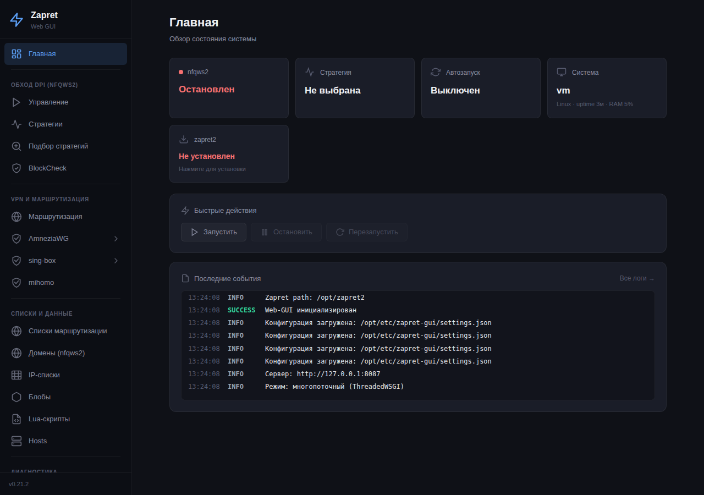
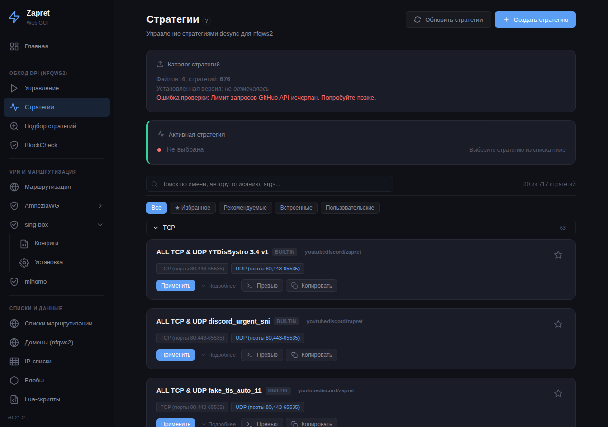
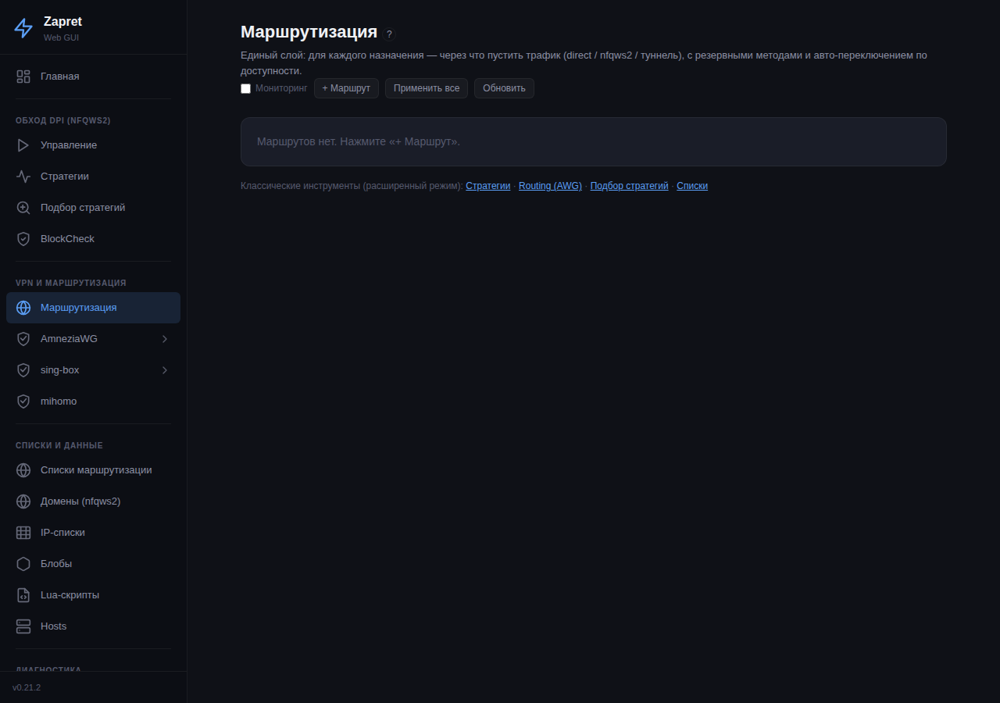
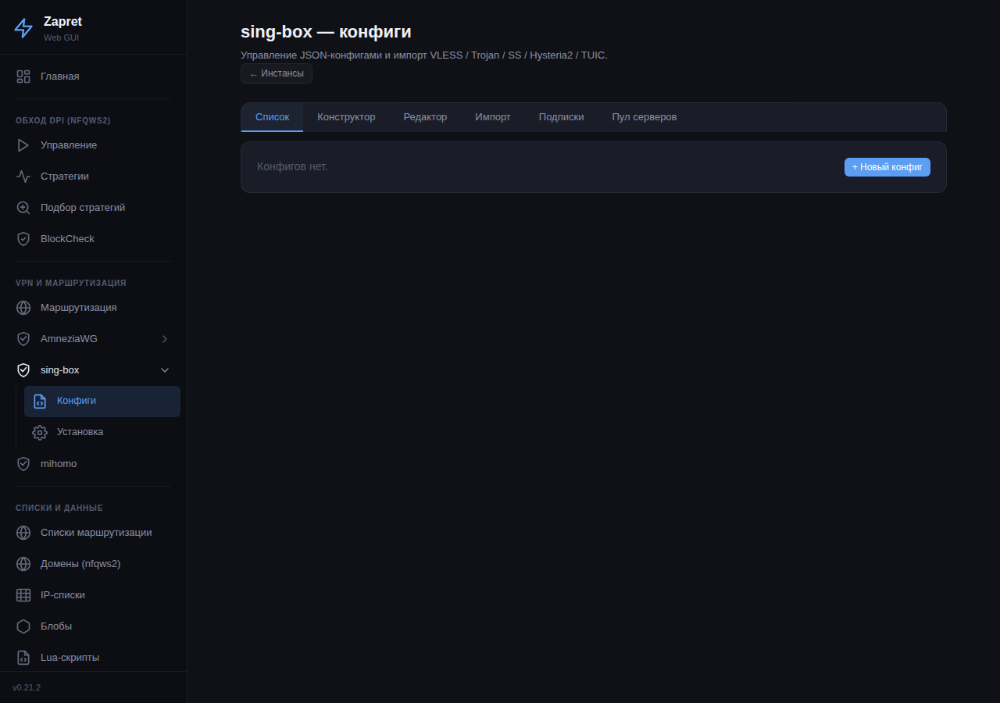
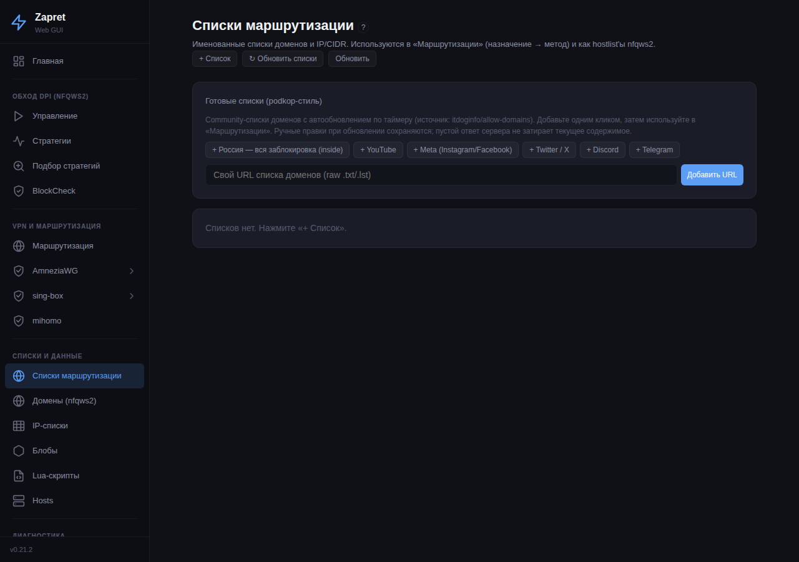
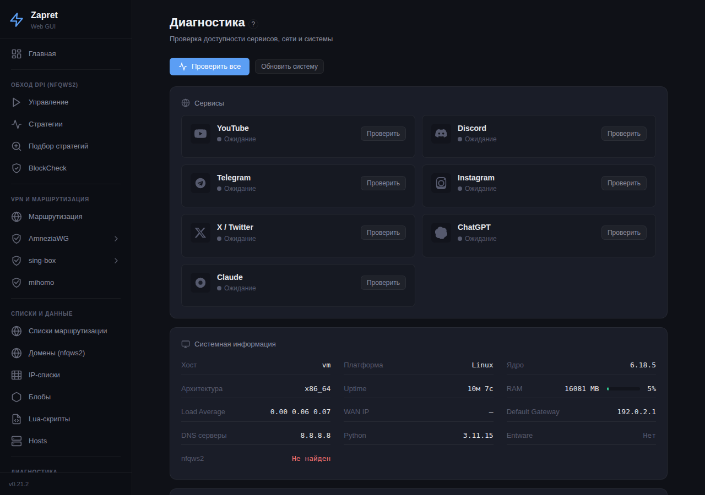
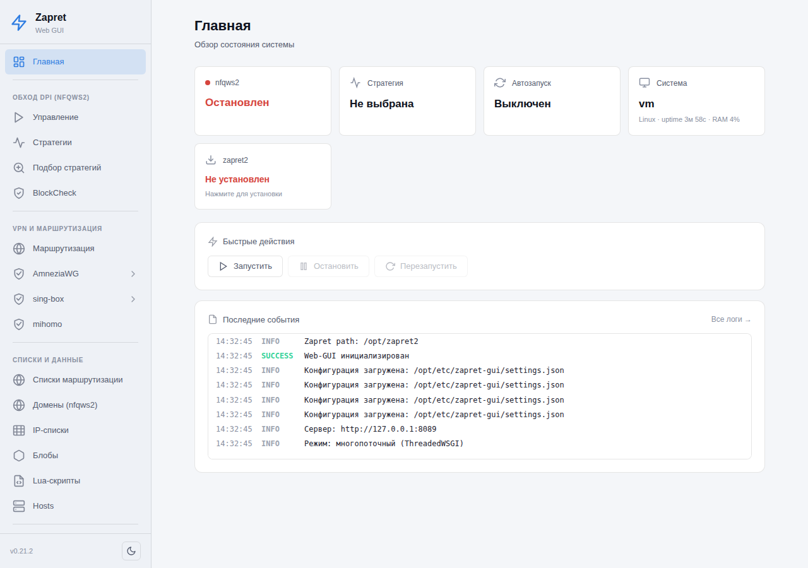

# Zapret Web-GUI

[](https://github.com/avatarDD/zapret-gui/releases/latest)
[](https://github.com/avatarDD/zapret-gui/actions)
[](LICENSE)

> [!IMPORTANT]
> Данный материал подготовлен в научно-технических целях.
> Использование предоставленных материалов в целях отличных от ознакомления может являться нарушением действующего законодательства.
> Автор не несет ответственности за неправомерное использование данного материала.

> [!WARNING]
> **Вы пользуетесь этой инструкцией на свой страх и риск!**
> 
> Автор не несёт ответственности за порчу оборудования и программного обеспечения, проблемы с доступом и потенцией.
> Подразумевается, что вы понимаете, что вы делаете.

---

**Веб-интерфейс для обхода блокировок на роутерах** с Entware (Keenetic)
и OpenWrt. Объединяет в одном окне:

- **nfqws2** (zapret2) — обход DPI «на месте», без туннеля;
- туннели **AmneziaWG / sing-box / mihomo** — когда ресурс заблокирован
  по IP и нужен прокси/VPN;
- **единый слой маршрутизации** «назначение → метод» поверх всего этого:
  для каждого домена/списка/подсети вы выбираете, *через что* пустить
  трафик, с резервной цепочкой и автопереключением при сбое.

Тёмная/светлая тема и режим **«эксперт»** (переключатели в подвале
бокового меню), мобильная адаптация, SPA на vanilla JS + лёгкий
Python/Bottle-бэкенд. Работает как на роутере с ~20 МБ RAM, так и на
обычном Linux-ПК / VPS (в т.ч. с одной сетевой картой).

> 📘 **Для разработчиков** — архитектура, модули, REST API, сборка пакетов
> и соглашения вынесены в отдельный документ: **[CoderManual.md](CoderManual.md)**.



---

## Содержание

- [Кому это нужно](#кому-это-нужно)
- [Установка](#установка)
- [Первый запуск и быстрый старт](#первый-запуск-и-быстрый-старт)
- [Разделы интерфейса — подробно](#разделы-интерфейса--подробно)
  - [Главная](#главная)
  - [Обход DPI: Управление, Стратегии, Подбор, BlockCheck](#обход-dpi-nfqws2)
  - [Маршрутизация (единый слой)](#маршрутизация-единый-слой)
  - [AmneziaWG](#amneziawg)
  - [sing-box](#sing-box)
  - [mihomo](#mihomo)
  - [Списки, домены, IP, блобы, Lua, hosts](#списки-и-данные)
  - [Диагностика, логи, автозапуск, настройки](#диагностика-и-обслуживание)
- [Управление из консоли (CLI)](#управление-из-консоли-cli)
- [Обновление и удаление](#обновление-и-удаление)
- [Откуда что качается (ресурсы)](#откуда-что-качается-ресурсы)
- [Заимствования и благодарности](#заимствования-и-благодарности)
- [Лицензия](#лицензия)

---

## Кому это нужно

- У вас **роутер Keenetic** (с Entware/OPKG) или **OpenWrt 22.03+**, и
  часть сайтов/сервисов не открывается из-за DPI или блокировки по IP.
- …либо **обычный Linux-ПК / VPS** (даже с одной сетевой картой): GUI
  определит окружение и в локальном режиме завернёт исходящий трафик
  самой машины, не ломая входящие SSH/веб.
- Хотите **точечный** обход: YouTube/Discord/Instagram — через обход или
  туннель, остальное — напрямую, без потери скорости.
- Не хотите ковыряться в командной строке — нужен веб-интерфейс с
  подсказками, диагностикой и автоподбором рабочих настроек.

Требования:

| Параметр | Значение |
|----------|----------|
| Python | 3.11+ (`python3-light` в Entware) |
| Зависимость | нет — Bottle встроен (`vendor/bottle.py`; системный `python3-bottle`, если стоит, приоритетен) |
| RAM | ~20–25 МБ |
| Flash | ~700 КБ (+ python3-light ~5 МБ) |
| Архитектуры | mipsel, mips, arm64, armv7, x86_64, riscv64 |

---

## Установка

### Вариант 1: ipk-пакет (рекомендуется)

**Keenetic (Entware):**
```bash
wget https://github.com/avatarDD/zapret-gui/releases/latest/download/zapret-gui-keenetic.ipk
opkg install zapret-gui-keenetic.ipk
/opt/etc/init.d/S99zapret-gui start
```

**Другие роутеры с Entware (ASUS, Xiaomi, GL.iNet и т.п.):**
```bash
wget https://github.com/avatarDD/zapret-gui/releases/latest/download/zapret-gui-entware.ipk
opkg install zapret-gui-entware.ipk
/opt/etc/init.d/S99zapret-gui start
```

**OpenWrt:**
```bash
wget https://github.com/avatarDD/zapret-gui/releases/latest/download/zapret-gui-openwrt.ipk
opkg install zapret-gui-openwrt.ipk
/etc/init.d/zapret-gui start
```

**Linux (tar.gz):**
```bash
wget https://github.com/avatarDD/zapret-gui/releases/latest/download/zapret-gui-linux.tar.gz
tar xzf zapret-gui-linux.tar.gz && cd zapret-gui
python3 app.py --host 0.0.0.0 --port 8080
```

### Вариант 2: автоустановка скриптом
```bash
wget -O - https://raw.githubusercontent.com/avatarDD/zapret-gui/main/install.sh | sh
```
Скрипт сам определит платформу, поставит зависимости и запустит GUI.

### Вариант 3: вручную из репозитория
```bash
cd /opt && git clone https://github.com/avatarDD/zapret-gui.git && cd zapret-gui
opkg install python3-light
python3 app.py --host 0.0.0.0 --port 8080
```
> Bottle ставить не нужно — он встроен (`vendor/bottle.py`) и подключается
> автоматически, когда системного нет.

### Если GitHub заблокирован

Бинарники (nfqws2, sing-box, mihomo, amneziawg) и обновления самого GUI
можно ставить в обход недоступного GitHub:

- **Зеркало / локальная папка** — задайте `ZAPRET_GUI_MIRROR`, либо
  `install.mirror` в Настройках, либо путь `file://…`.
- **Транспорт скачивания** — в разделах установки селект «Качать через»:
  напрямую, либо через уже поднятый AWG-туннель / sing-box / mihomo
  (запрос к GitHub идёт через обход). Работает и для nfqws2, и для кнопки
  «Обновить GUI».
- **Локальный файл** — скачайте релиз на компьютер и загрузите бинарь
  через GUI («Установить из локального файла…»).
- **Выбор версии** — по умолчанию последняя, но можно поставить любую из
  списка релизов (в т.ч. откатиться на более старую).

Подробности по зеркалу — в разделе
[Настройки](#диагностика-и-обслуживание).

---

## Первый запуск и быстрый старт

Откройте в браузере **`http://<IP-роутера>:8080`**.

**Сценарий А — «просто открыть YouTube/Discord без VPN» (обход DPI):**

1. **Zapret2** → нажмите «Установить» (скачает бинарь nfqws2 с GitHub).
2. **Подбор стратегий** → запустите автоперебор: GUI сам найдёт рабочую
   стратегию обхода для ваших сервисов.
3. Примените найденную стратегию (или зайдите в **Стратегии** и выберите
   вручную) → **Управление** → «Запустить».
4. **Автозапуск** → включите, чтобы работало после перезагрузки роутера.

**Сценарий Б — «ресурс заблокирован по IP, нужен туннель»:**

1. Поднимите туннель: **AmneziaWG** (в т.ч. Cloudflare WARP),
   **sing-box** или **mihomo** (см. разделы ниже).
2. **Списки** → добавьте готовый список доменов (например, YouTube) или
   создайте свой.
3. На странице **Списки** нажмите у списка **«→ Маршрут»** → выберите
   туннель → «Создать маршрут». Готово: эти домены пойдут в туннель,
   остальное — напрямую.

**Сценарий В — «и то, и другое с автопереключением»:** настройте в
**Маршрутизации** для каждого назначения primary-метод и цепочку
fallback'ов, включите мониторинг — система сама переключится на рабочий
способ, если основной «упадёт».

---

## Разделы интерфейса — подробно

Меню слева сгруппировано: **Обход DPI**, **VPN и маршрутизация**,
**Списки и данные**, **Диагностика и обслуживание**. Почти у каждой
страницы есть кнопка «**?**» с примерами.

### Главная

Обзор состояния: статус nfqws2, текущая стратегия, автозапуск, система
(uptime/RAM), установлен ли zapret2. Блок «Быстрые действия»
(Запустить/Остановить/Перезапустить) и лента последних событий (логи в
реальном времени).

### Обход DPI (nfqws2)

Обход DPI работает **без туннеля**: nfqws2 перехватывает исходящие
пакеты и «ломает» работу DPI (фрагментация TLS ClientHello, fake-пакеты,
desync), чтобы блокировка по SNI/домену не срабатывала.

#### Управление
Старт/стоп/рестарт демона, мониторинг процесса (PID, аптайм), превью
итоговой команды запуска.

#### Стратегии


Стратегия — это набор аргументов nfqws2 (профилей). Здесь:
- список **встроенных** и **пользовательских** стратегий;
- редактор: создаёте стратегию из профилей, каждый профиль = набор
  приёмов desync для своего фильтра (TCP 443, HTTP 80, QUIC и т.д.);
  
- **Превью** — показывает финальную командную строку перед применением;
- доступны стратегии из INI-каталогов (`basic` / `advanced` / `direct` /
  `builtin`), обновляемых из апстрима.

*Пример:* создать стратегию → добавить профиль для `tcp/443` с приёмом
`multisplit` + `fake` → Превью → Сохранить → Применить.

#### Подбор стратегий
Автоматический перебор стратегий из каталогов против ваших целей. GUI
тестирует доступность, ранжирует приёмы от простых к сложным и
показывает первую рабочую. Можно сразу применить лучшую найденную.

#### BlockCheck
Тестирование доступности сервисов и **классификация типа блокировки**:
различает блок на уровне **IP** (TCP-connect не проходит → нужен
туннель) и **DPI/SNI** (TCP ок, рвётся TLS → поможет zapret). Поле
`remediation` подсказывает способ: `zapret` / `tunnel` / `dns`. Есть
детект троттлинга YouTube, QUIC-блока, traceroute до точки обрыва.

### Маршрутизация (единый слой)



Центральная страница. Таблица правил «**назначение → метод**»:

- **Назначение** — домены, CIDR, именованный список, geosite/geoip.
- **Метод** — `direct` (напрямую), `nfqws2` (обход DPI),
  `awg:<iface>` / `singbox:<iface>` / `mihomo:<iface>` (туннель).
- **Резервная цепочка (fallback)** — если primary деградирует, трафик
  уходит на следующий метод.
- **Мониторинг + автопереключение** — TLS-проба назначения; при падении
  успешности ниже порога метод переключается автоматически (с
  гистерезисом и cooldown, без «дёрганья»).
- **«Подобрать»** — для деградировавшего nfqws2-маршрута запускает
  подбор стратегии прямо отсюда.

*Пример:* `youtube.com, googlevideo.com → singbox:proxy` с fallback
`nfqws2`; включить мониторинг — если прокси ляжет, домены автоматически
переедут на обход DPI.

### AmneziaWG

Туннели WireGuard / AmneziaWG поверх роутера + точечная маршрутизация в
них. Подменю:

- **Setup** — мастер: детект окружения, недостающие пакеты (например,
  OpkgTun на Keenetic), установка бинарников `amneziawg-go`/`-tools`
  (скачиваются из наших Releases, проверка sha256).
- **Dashboard** — статус интерфейсов/пиров, up/down, handshake, трафик
  (sparkline), автозапуск, «переподключать при плохом соединении»
  (watchdog: handshake-age + активная проба через туннель).
- **Configs** — редактор `.conf` со всеми AWG-полями (`Jc`, `Jmin`,
  `Jmax`, `S1/S2`, `H1…H4`, `I`), импорт текстом/файлом, экспорт.
- **WARP** — Cloudflare WARP: импорт готового конфига, **нативная
  генерация** через `api.cloudflareclient.com` (регистрация, опц. WARP+
  по ключу), **WARP-in-WARP** (два WARP друг над другом).
- **Routing** — selective routing в туннель по: CIDR, доменам (через
  dnsmasq+ipset/nftset), устройствам (по IP/MAC), **DSCP-меткам (QoS)**.

### sing-box



Универсальный прокси-движок. Возможности:

- **Инстансы** — несколько конфигов, up/down/restart, валидация через
  `sing-box check`.
- **Конструктор/Редактор** — собрать outbound (VLESS/VMess/Trojan/SS/
  Hysteria2/TUIC) через форму или править JSON напрямую.
- **Импорт** — вставить ключи `vmess://`/`vless://`/`trojan://`/`ss://`/
  `hysteria2://`/`tuic://` или URL подписки.
- **Подписки** — сохранённый URL обновляется по таймеру; outbound'ы
  оборачиваются в **urltest** — sing-box сам пингует серверы и
  **бесшовно переключается** на живой с минимальной задержкой (если
  сервер «упал», трафик мгновенно идёт через другой, без рестарта).
  Если URL вернул пусто — текущие серверы не затираются.
- **Пул серверов** — слияние множества **публичных источников** (свалки
  бесплатных ключей) в один конфиг `server-pool`: дедуп, потолок числа
  серверов, last-good кэш, обёртка в urltest. Источники редактируются;
  есть рекомендованные пресеты.
- **Тестер серверов** — проверяет каждый сервер: быстрый TCP-отсев
  мёртвых + e2e-замер задержки **через движок** до крупного облака
  (Cloudflare/Amazon). Показывает статус каждого сервера (жив/мёртв +
  ms). Опция «фильтр живых» при сборке пула отсеивает мусор.
- **Прозрачное проксирование** — режимы **TProxy / Redirect / Hybrid** с
  выбором **области**: *LAN-клиенты* (роутер форвардит сеть) или *Эта
  машина* — локальный режим для ПК/VPS с одной сетевухой (заворачивается
  только исходящий трафик самого хоста, без разрыва входящих SSH/веб).
  DNS-hijack, anti-leak IPv6.

*Пример (бесплатные серверы за минуту):* sing-box → вкладка «Пул
серверов» → добавить пресеты → включить «фильтр живых» → «Собрать пул
сейчас» → запустить инстанс `server-pool`. Дальше — «Тест серверов»,
чтобы видеть, что живо.

### mihomo

Движок Clash.Meta как альтернатива sing-box. Подменю **Прокси** и
**Установка**:

- **Установка** — отдельный раздел (как у sing-box): окружение, версия
  «установлено / в релизе» (апстрим MetaCubeX/mihomo), установка/
  обновление/удаление с прогрессом, выбор версии и транспорта скачивания.
- **Инстансы** — несколько конфигов, up/down/restart, валидация через
  `mihomo -t`, YAML-редактор (парсится готовым clash-YAML-парсером).
- **Прокси-таблица** (паритет с sing-box) — серверы из секции `proxies`
  с задержкой и трафиком, мультивыбор, сортировка, тест, активация
  выбранного, импорт/экспорт `vless://`/`vmess://`/`ss://`/… ссылок,
  переключение узла через external-controller (Clash API), режим отладки.

Доменный/прозрачный роутинг mihomo идёт через единый слой маршрутизации
и TUN (см. раздел [«Маршрутизация»](#маршрутизация-единый-слой)).

### Списки и данные

#### Списки маршрутизации


Именованные списки доменов и IP/CIDR — общий «строительный материал» для
единого слоя и nfqws2-hostlist'ов. Возможности:

- **Готовые списки (podkop-стиль)** — community-подборки доменов
  (YouTube, Meta, X, Discord, Telegram, «вся заблокировка в РФ»;
  источник [itdoginfo/allow-domains](https://github.com/itdoginfo/allow-domains))
  добавляются **одним кликом** и **обновляются по таймеру**. Ваши ручные
  правки при обновлении сохраняются, пустой ответ сервера не затирает
  текущее содержимое. Можно добавить **свой URL**.
- **«→ Маршрут»** — у каждого списка кнопка, создающая правило
  маршрутизации (домены списка → выбранный метод) в один клик.
- Ручное создание/редактирование, импорт текстом.

#### Домены (nfqws2)
Hostlist'ы для фильтрации nfqws2 с нормализацией. Запись `example.com`
автоматически покрывает и поддомены (`*.example.com`).

#### IP-списки
IP-адреса и подсети; загрузка по **ASN** (автоматически тянет диапазоны
автономной системы). На OpenWrt — nftset, на Entware — ipset.

#### Блобы
Бинарные данные для fake-пакетов: hex-редактор, генерация fake TLS/HTTP
ClientHello для приёмов desync.

#### Lua-скрипты
Управление .lua-скриптами nfqws2 (продвинутые сценарии desync).

#### Hosts
Управление `/etc/hosts` с пресетами (например, фиксированные IP для
обхода DNS-блокировок).

### Диагностика и обслуживание

#### Диагностика


- проверки **ping / HTTP(S) / DNS** до сервисов;
- статус firewall;
- **«Конфликты и окружение»** — находит сторонние процессы nfqws/tpws и
  предупреждает о co-установленных системах обхода
  (**getdomains / XKeen / podkop / HydraRoute / Xray / redsocks**),
  которые спорят с единым слоем и прозрачным проксированием. Каждое
  предупреждение — с пояснением, почему конфликтует;
- **Самодиагностика** — проверка зависимостей (python-модули вкл. Bottle,
  системные утилиты), движков (zapret2/AWG/sing-box/mihomo),
  конфигурации, сети + прогон юнит-тестов **прямо на устройстве**
  (результат пишется в лог). Без браузера: `python3 -m core.selfcheck`;
- расширенная системная информация.

#### Логи
Журнал событий в реальном времени (SSE-поток). Логи держатся в RAM, на
flash не пишутся.

#### Zapret2
Установка/обновление бинаря nfqws2 с GitHub (или зеркала). Здесь же —
уведомление о доступной новой версии GUI и кнопка «Обновить GUI».

#### Автозапуск
Генерация init-скрипта под платформу (Entware S99 / OpenWrt procd /
systemd), чтобы nfqws2 и туннели поднимались после перезагрузки.

#### Настройки
Конфигурация GUI (порт), nfqws (порты TCP/UDP), firewall, **зеркало**
для бинарников, тумблер «единый nfqws2-hostlist», и **Бэкап** — выгрузка
всей конфигурации (полный `settings.json`: стратегия, автозапуск,
маршруты единого слоя, именованные/курируемые списки, подписки и пул
sing-box, зеркало; + пользовательские стратегии, конфиги sing-box/mihomo,
hostlist'ы) в один JSON-файл и восстановление из него. Тема интерфейса
хранится локально в браузере и в бэкап не входит.

> **Тема:** тёмная/светлая — переключатель (☾/☀) в подвале бокового меню.
> Выбор запоминается в браузере и применяется мгновенно.
>
> **Режим «эксперт»:** галка там же, в подвале меню. По умолчанию ВЫКЛ —
> продвинутые поля (NFQUEUE и метки, DSCP, debug, выбор архитектуры при
> установке, fallback-цепочки маршрутизации) скрыты; включите, чтобы их
> увидеть. Выбор тоже запоминается в браузере.



---

## Управление из консоли (CLI)

После установки доступна команда `zapret-gui` (по SSH, без браузера):

```bash
zapret-gui status                       # общий статус
zapret-gui nfqws {start|stop|restart|status}
zapret-gui strategy {list|apply <id>}
zapret-gui singbox {list|up|down|restart <name>}
zapret-gui mihomo  {list|up|down|restart <name>}
```

Из клона репозитория — напрямую: `python3 app.py status`.

---

## Обновление и удаление

```bash
# Обновление
opkg upgrade zapret-gui            # через пакетный менеджер
./install.sh --update              # скриптом
# либо кнопка «Обновить GUI» на странице Zapret2

# Удаление
opkg remove zapret-gui
./uninstall.sh                     # конфиг сохраняется
./uninstall.sh --full              # полное удаление
```

---

## Откуда что качается (ресурсы)

GUI сам по себе — это Python/JS-код; «тяжёлые» бинарники и списки
тянутся из внешних источников (все можно проксировать через зеркало
`ZAPRET_GUI_MIRROR` / `file://`):

| Что | Откуда | Где используется |
|-----|--------|------------------|
| **nfqws2** (zapret2) | [bol-van/zapret](https://github.com/bol-van/zapret) (Releases) | Страница Zapret2 |
| **INI-каталоги стратегий** | [youtubediscord/zapret](https://github.com/youtubediscord/zapret) | Стратегии / Подбор (обновление каталогов) |
| **sing-box** | сборка в наших Releases (тег `singbox-bin-*`); upstream-код — [SagerNet/sing-box](https://github.com/SagerNet/sing-box) | sing-box → установка |
| **mihomo** (Clash.Meta) | [MetaCubeX/mihomo](https://github.com/MetaCubeX/mihomo) (Releases) | mihomo → установка |
| **amneziawg-go / -tools** | сборка в наших Releases (тег `awg-bin-vX`) | AmneziaWG → Setup |
| **Cloudflare WARP** | `api.cloudflareclient.com` | AmneziaWG → WARP (нативная генерация) |
| **Курируемые списки доменов** | [itdoginfo/allow-domains](https://github.com/itdoginfo/allow-domains) | Списки → Готовые списки |
| **Публичные серверы (пул)** | [Epodonios/v2ray-configs](https://github.com/Epodonios/v2ray-configs), [ebrasha/free-v2ray-public-list](https://github.com/ebrasha/free-v2ray-public-list), [igareck/vpn-configs-for-russia](https://github.com/igareck/vpn-configs-for-russia), [kort0881/vpn-vless-configs-russia](https://github.com/kort0881/vpn-vless-configs-russia) | sing-box → Пул серверов (пресеты) |
| **Проба тестера** | `cp.cloudflare.com` / `aws.amazon.com` / `www.gstatic.com` (generate_204) | sing-box → Тест серверов |
| **IP по ASN** | публичные ASN-реестры | IP-списки → загрузка по ASN |

> Списки публичных серверов — это «свалки» бесплатных ключей: качество
> низкое, поэтому включайте «фильтр живых» и urltest. Подписки/серверы —
> на ваш риск; редактируйте список источников под себя.

---

## Заимствования и благодарности

Проект многое перенял (идеи и подходы, не код, если не указано иное) у
сообщества:

- [bol-van/zapret](https://github.com/bol-van/zapret) — основной
  инструмент обхода DPI (nfqws2).
- [nfqws/nfqws2-keenetic](https://github.com/nfqws/nfqws2-keenetic) —
  firewall-обвязка автозапуска (цепочки `nfqws_pre/post/nat`, метки
  MARK_PROCESSED/EXCLUDE, правила на оба направления, NAT для UDP,
  тюнинг conntrack) портирована из их init-скрипта; идеи интеграции с
  Keenetic.
- [youtubediscord/zapret](https://github.com/youtubediscord/zapret) —
  каталоги стратегий и winws2-пресеты (источник обновлений).
- [Shiperoid/YT-DPI](https://github.com/Shiperoid/YT-DPI) — идеи
  диагностики: троттлинг, реальные CDN-шарды googlevideo, Deep Trace,
  QUIC, большой ClientHello.
- [jameszeroX/XKeen](https://github.com/jameszeroX/XKeen) — прозрачные
  режимы TProxy/Redirect/Hybrid, движок mihomo, DSCP-роутинг, CLI,
  оффлайн-зеркало, совместимость с политиками Keenetic.
- [rcd27/blockcheckw](https://github.com/rcd27/blockcheckw) (MIT) —
  IP-блок vs DPI-блок + `remediation`, ранжирование стратегий, методы
  `tcpseg`/`oob`, генератор стратегий «на лету».
- [itdoginfo/podkop](https://github.com/itdoginfo/podkop) +
  [itdoginfo/allow-domains](https://github.com/itdoginfo/allow-domains)
  — идея курируемых списков доменов с автообновлением и
  selective-routing через sing-box.
- [qzeleza/kvas](https://github.com/qzeleza/kvas) — подход
  DNS/ipset-маршрутизации и суффикс-матчинг доменов.
- [SagerNet/sing-box](https://github.com/SagerNet/sing-box),
  [MetaCubeX/mihomo](https://github.com/MetaCubeX/mihomo),
  [amnezia-vpn/amneziawg-go](https://github.com/amnezia-vpn/amneziawg-go)
  — движки туннелей.
- [Bottle](https://bottlepy.org/) — микро-фреймворк бэкенда.

---

## Лицензия

MIT.
