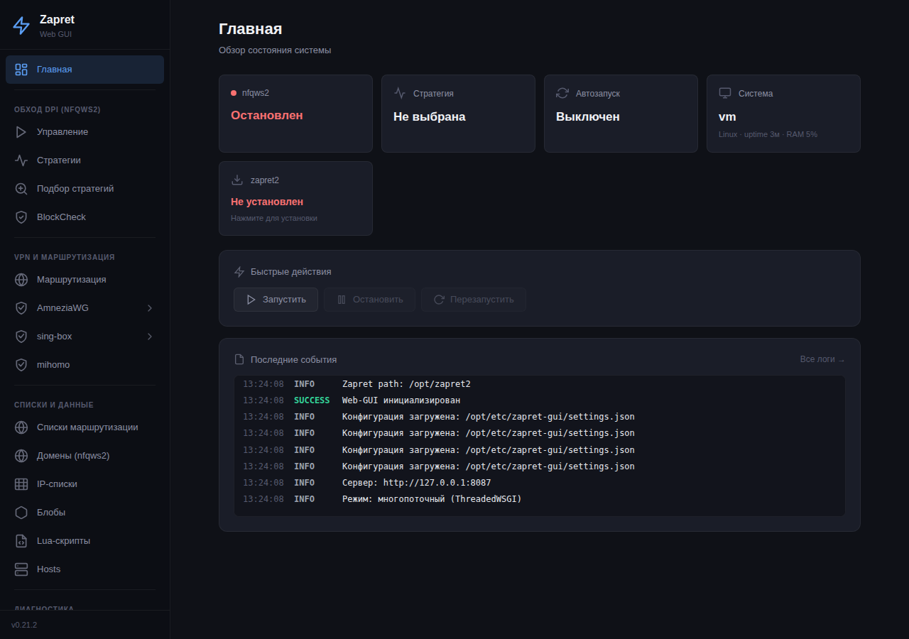
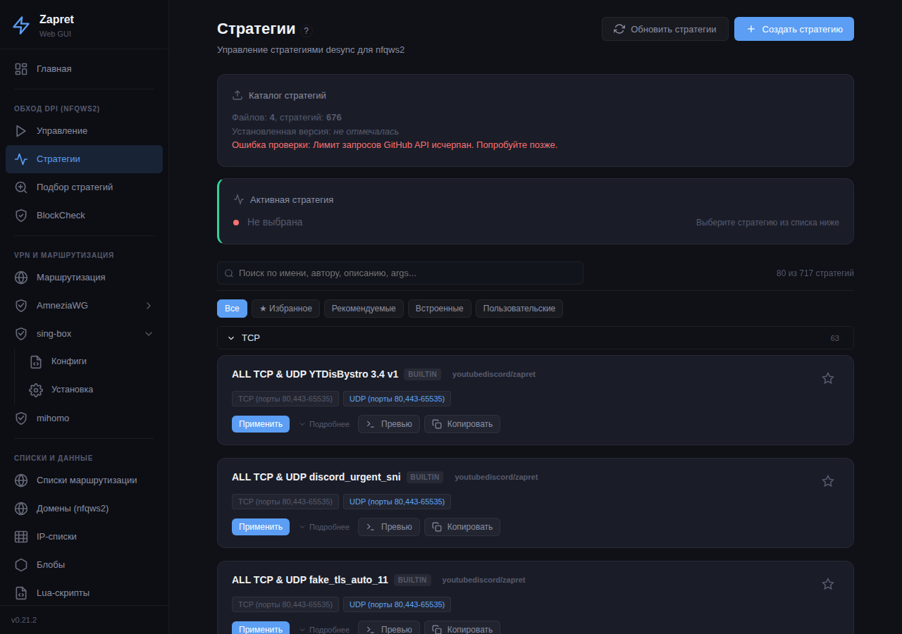
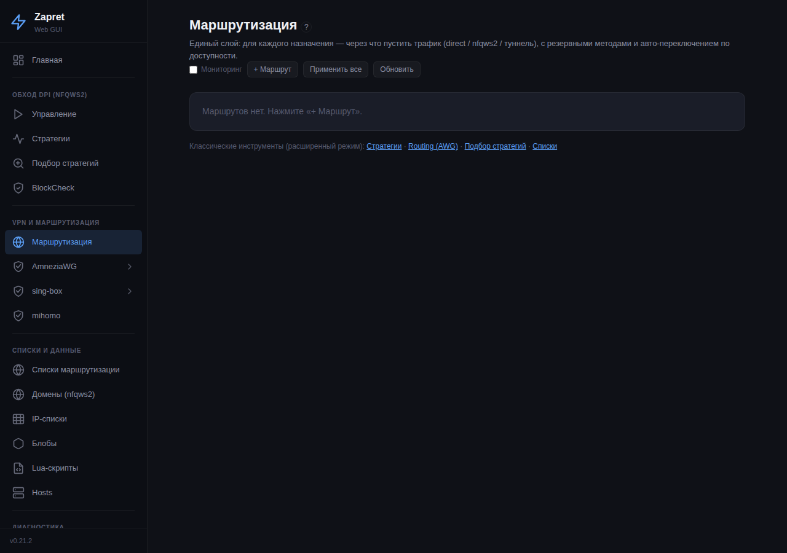
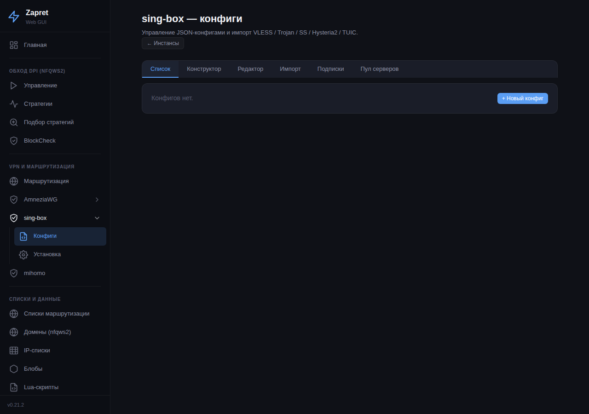
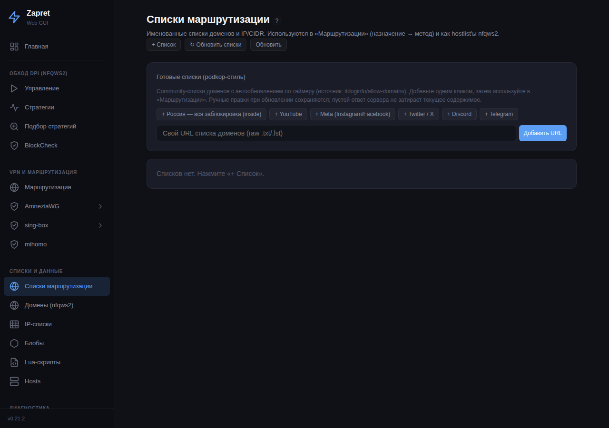
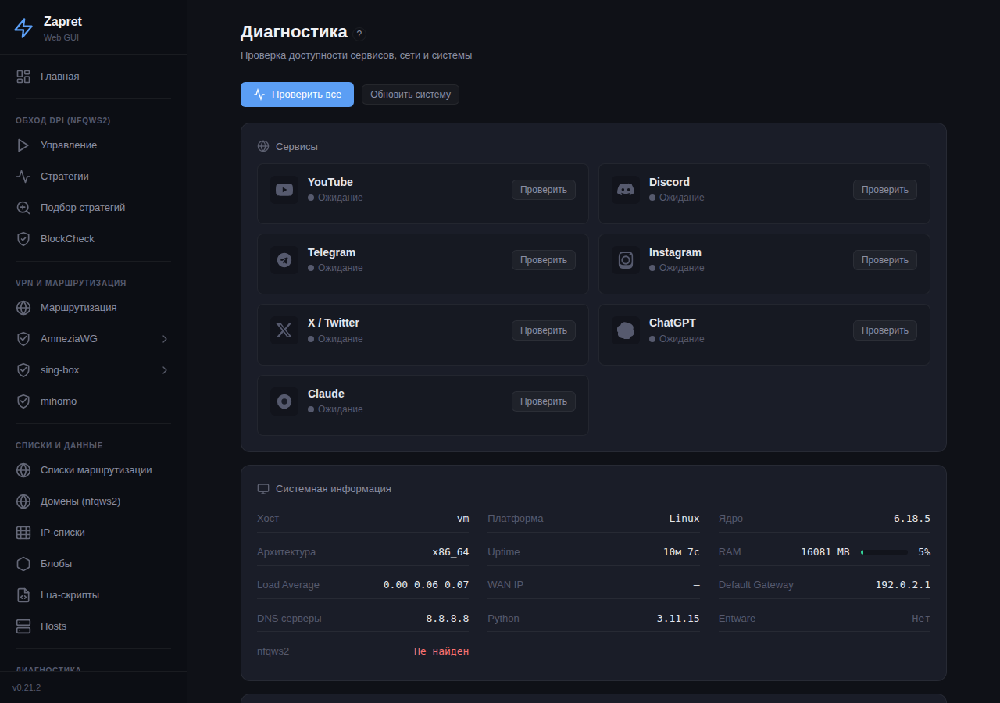
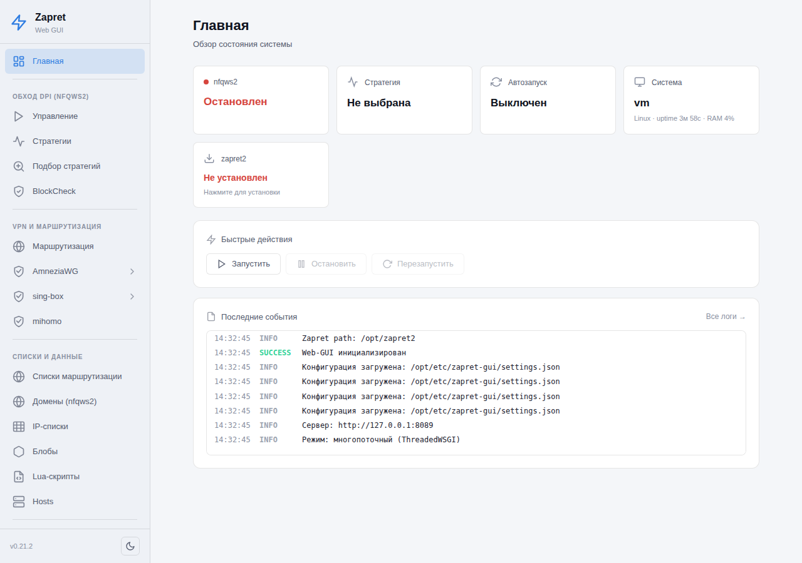

# Zapret Web-GUI

[](https://github.com/avatarDD/zapret-gui/releases/latest)
[](https://github.com/avatarDD/zapret-gui/actions)
[](LICENSE)

> [!IMPORTANT]
> Данный материал подготовлен в научно-технических целях.
> Использование предоставленных материалов в целях отличных от ознакомления может являться нарушением действующего законодательства.
> Автор не несет ответственности за неправомерное использование данного материала.

> [!WARNING]
> **Вы пользуетесь этой инструкцией на свой страх и риск!**
> 
> Автор не несёт ответственности за порчу оборудования и программного обеспечения, проблемы с доступом и потенцией.
> Подразумевается, что вы понимаете, что вы делаете.

---

**Веб-интерфейс для обхода блокировок на роутерах** с Entware (Keenetic)
и OpenWrt. Объединяет в одном окне:

- **nfqws2** (zapret2) — обход DPI «на месте», без туннеля;
- туннели **AmneziaWG / sing-box / mihomo** — когда ресурс заблокирован
  по IP и нужен прокси/VPN;
- **WARP/MASQUE (usque)** — бесплатный Cloudflare WARP поверх HTTPS/QUIC,
  выручает там, где WARP по WireGuard уже режется;
- запасные каналы без своего сервера — **Opera Proxy** (SurfEasy) и
  **Telegram Tunnel** (локальный MTProto-прокси);
- **единый слой маршрутизации** «назначение → метод» поверх всего этого:
  для каждого домена/списка/подсети вы выбираете, *через что* пустить
  трафик, с резервной цепочкой и автопереключением при сбое.

Тёмная/светлая тема и режим **«эксперт»** (переключатели в подвале
бокового меню), мобильная адаптация, SPA на vanilla JS + лёгкий
Python/Bottle-бэкенд. Работает как на роутере с ~20 МБ RAM, так и на
обычном Linux-ПК / VPS (в т.ч. с одной сетевой картой).

> 📘 **Для разработчиков** — архитектура, модули, REST API, сборка пакетов
> и соглашения вынесены в отдельный документ: **[CoderManual.md](CoderManual.md)**.



---

## Содержание

- [Кому это нужно](#кому-это-нужно)
- [Установка](#установка)
- [Первый запуск и быстрый старт](#первый-запуск-и-быстрый-старт)
- [Разделы интерфейса — подробно](#разделы-интерфейса--подробно)
  - [Главная](#главная)
  - [Обход DPI: Управление, Стратегии, Подбор, BlockCheck](#обход-dpi-nfqws2)
  - [Маршрутизация (единый слой)](#маршрутизация-единый-слой)
  - [AmneziaWG](#amneziawg)
  - [WARP/MASQUE (usque)](#warpmasque-usque)
  - [Opera Proxy](#opera-proxy)
  - [Telegram Tunnel](#telegram-tunnel)
  - [sing-box](#sing-box)
  - [mihomo](#mihomo)
  - [Мониторинг и оптимизация туннелей](#мониторинг-и-оптимизация-туннелей)
  - [Списки, домены, IP, блобы, Lua, hosts, per-domain DNS](#списки-и-данные)
  - [Диагностика, логи, обновления, автозапуск, настройки](#диагностика-и-обслуживание)
- [Управление через ИИ (MCP)](#управление-через-ии-mcp)
  - [Как включить](#как-включить) и [какие разрешения выдать](#какие-разрешения-выдать)
  - [Подключение клиента](#подключение-клиента) и [проверка без клиента: curl и консоль](#проверка-без-клиента-curl-и-консоль)
  - [Примеры: что попросить и что модель сделает](#примеры-что-попросить-и-что-модель-сделает)
  - [Что модель умеет](#что-модель-умеет) · [Журнал и откат](#журнал-и-откат) · [Если не подключается](#если-не-подключается)
  - [Риски](#риски--честно) · [Shell](#shell-shell_readonly-против-shell_full) · [Самоправка GUI](#самоправка-модель-переписывает-сам-gui)
- [Управление из консоли (CLI)](#управление-из-консоли-cli)
- [Обновление и удаление](#обновление-и-удаление)
- [Откуда что качается (ресурсы)](#откуда-что-качается-ресурсы)
- [Заимствования и благодарности](#заимствования-и-благодарности)
- [Лицензия](#лицензия)

---

## Кому это нужно

- У вас **роутер Keenetic** (с Entware/OPKG) или **OpenWrt 22.03+**, и
  часть сайтов/сервисов не открывается из-за DPI или блокировки по IP.
- …либо **обычный Linux-ПК / VPS** (даже с одной сетевой картой): GUI
  определит окружение и в локальном режиме завернёт исходящий трафик
  самой машины, не ломая входящие SSH/веб.
- Хотите **точечный** обход: YouTube/Discord/Instagram — через обход или
  туннель, остальное — напрямую, без потери скорости.
- Не хотите ковыряться в командной строке — нужен веб-интерфейс с
  подсказками, диагностикой и автоподбором рабочих настроек.

Требования:

| Параметр | Значение |
|----------|----------|
| Python | 3.11+ (`python3-light` в Entware) |
| Зависимость | нет — Bottle встроен (`vendor/bottle.py`; системный `python3-bottle`, если стоит, приоритетен) |
| RAM | ~20–25 МБ |
| Flash | ~700 КБ (+ python3-light ~5 МБ) |
| Архитектуры | mipsel, mips, arm64, armv7, x86_64, riscv64 |

---

## Установка

### Вариант 1: ipk-пакет (рекомендуется)

**Keenetic (Entware):**
```bash
opkg update
wget -O zapret-gui-keenetic.ipk https://github.com/avatarDD/zapret-gui/releases/latest/download/zapret-gui-keenetic.ipk
opkg install ./zapret-gui-keenetic.ipk
/opt/etc/init.d/S99zapret-gui start
```

**Другие роутеры с Entware (ASUS, Xiaomi, GL.iNet и т.п.):**
```bash
opkg update
wget -O zapret-gui-entware.ipk https://github.com/avatarDD/zapret-gui/releases/latest/download/zapret-gui-entware.ipk
opkg install ./zapret-gui-entware.ipk
/opt/etc/init.d/S99zapret-gui start
```

**OpenWrt 24.10 и старее — opkg:**
```bash
opkg update
wget -O zapret-gui-openwrt.ipk https://github.com/avatarDD/zapret-gui/releases/latest/download/zapret-gui-openwrt.ipk
opkg install ./zapret-gui-openwrt.ipk
/etc/init.d/zapret-gui enable
/etc/init.d/zapret-gui start
```
Одной строкой (то же самое, удобно скопировать в SSH):
```bash
opkg update && wget -O zapret-gui-openwrt.ipk https://github.com/avatarDD/zapret-gui/releases/latest/download/zapret-gui-openwrt.ipk && opkg install ./zapret-gui-openwrt.ipk && /etc/init.d/zapret-gui enable && /etc/init.d/zapret-gui start
```

**OpenWrt 25.12+ и SNAPSHOT — apk:**
```bash
apk update
wget -O zapret-gui-openwrt.apk https://github.com/avatarDD/zapret-gui/releases/latest/download/zapret-gui-openwrt.apk
apk add --allow-untrusted ./zapret-gui-openwrt.apk
/etc/init.d/zapret-gui enable
/etc/init.d/zapret-gui start
```
Одной строкой (то же самое, удобно скопировать в SSH):
```bash
apk update && wget -O zapret-gui-openwrt.apk https://github.com/avatarDD/zapret-gui/releases/latest/download/zapret-gui-openwrt.apk && apk add --allow-untrusted ./zapret-gui-openwrt.apk && /etc/init.d/zapret-gui enable && /etc/init.d/zapret-gui start
```
> **Сначала `opkg update` (или `apk update`).** Зависимости пакета —
> `python3-light` и модули Python — ставятся из репозитория Entware/OpenWrt,
> а opkg берёт их имена и версии из локального индекса. Если индекс давно
> не обновлялся, opkg попытается скачать версию, которой в репозитории уже
> нет, и установка оборвётся ошибкой вида
> `Failed to download http://bin.entware.net/…/python3-base_3.11.10-1_….ipk`
> `… HTTP/1.1 404 Not Found` / `Perhaps you need to run 'opkg update'?`.
> Лечится ровно тем, что подсказывает opkg: `opkg update` и повторить
> `opkg install`. Версию Python пакет не закрепляет — подойдёт та, что
> сейчас лежит в репозитории.
>
> **Какой пакет ваш.** OpenWrt перешёл с opkg на apk не в 24.10, а в
> **25.12** (5 марта 2026) — до этого apk был только в main/SNAPSHOT.
> Релиз 24.10 остаётся на opkg: в его release notes прямо сказано
> «OpenWrt 24.10 uses OPKG only, APK packages are *not* supported. Only
> main branch was changed to APK». Поэтому на 24.10 нужен `.ipk`, а не
> `.apk`. Проверить надёжнее, чем по номеру версии:
> `command -v apk || command -v opkg`.
>
> Пакет `.apk` не подписан ключами репозитория, поэтому нужен флаг
> `--allow-untrusted` (обычная практика для локальных `.apk`), а имя
> файла — с `./`, чтобы apk взял именно файл, а не искал пакет в
> репозитории. У `opkg install` то же правило про `./`.
>
> `-O <имя>` у `wget` обязателен: ссылка `releases/latest/download/…` — это
> редирект, и `wget` без `-O` может сохранить файл под именем, полученным
> из конечного URL, — тогда следующая строка не найдёт
> `./zapret-gui-openwrt.apk` (или `.ipk`).
>
> В однострочнике команды соединены через `&&`, а не `;`: если скачивание
> не удалось, установка не начнётся. С `;` apk всё равно пытался поставить
> недокачанный файл и выдавал сбивающее с толку
> `./zapret-gui-openwrt.apk (no such package)` вместо честной ошибки wget.
>
> `enable` и `start` пакет делает сам в post-install, так что обычно они не
> нужны — но выполнить их повторно безвредно, а если сопровождающий скрипт
> у вас не отработал, именно они и включают автозапуск и поднимают GUI.

**Linux (tar.gz):**
```bash
wget https://github.com/avatarDD/zapret-gui/releases/latest/download/zapret-gui-linux.tar.gz
tar xzf zapret-gui-linux.tar.gz && cd zapret-gui
python3 app.py --host 0.0.0.0 --port 8080
```

### Вариант 2: автоустановка скриптом
```bash
wget -O - https://raw.githubusercontent.com/avatarDD/zapret-gui/main/install.sh | sh
```
Скрипт сам определит платформу, поставит зависимости и запустит GUI.

> **Если установка падает с `not found` или `No such file or directory`**,
> хотя файл на месте — почти наверняка у скрипта появились виндовые
> переводы строк (CRLF). Тогда ядро пытается запустить интерпретатор
> `/bin/sh\r`, которого нет. Так бывает, когда файл скачали браузером на
> Windows, отредактировали в блокноте или склонировали репозиторий с
> `core.autocrlf=true`. Лечится одним из двух способов:
> ```sh
> sh install.sh                      # запуск через sh игнорирует шебанг
> sed -i 's/\r$//' install.sh        # либо убрать CR из файла
> ```
> Способ из примера выше (`wget -O - … | sh`) этой проблеме не подвержен.

### Вариант 3: вручную из репозитория
```bash
cd /opt && git clone https://github.com/avatarDD/zapret-gui.git && cd zapret-gui
opkg update && opkg install python3-light
python3 app.py --host 0.0.0.0 --port 8080
```
> Bottle ставить не нужно — он встроен (`vendor/bottle.py`) и подключается
> автоматически, когда системного нет.

### Если GitHub заблокирован

Бинарники (nfqws2, sing-box, mihomo, amneziawg) и обновления самого GUI
можно ставить в обход недоступного GitHub:

- **Зеркало / локальная папка** — задайте `ZAPRET_GUI_MIRROR`, либо
  `install.mirror` в Настройках, либо путь `file://…`.
- **Транспорт скачивания** — в разделах установки селект «Качать через»:
  напрямую, либо через уже поднятый AWG-туннель / sing-box / mihomo
  (запрос к GitHub идёт через обход). Работает и для nfqws2, и для кнопки
  «Обновить GUI».
- **Локальный файл** — скачайте релиз на компьютер и загрузите бинарь
  через GUI («Установить из локального файла…»).
- **Выбор версии** — по умолчанию последняя, но можно поставить любую из
  списка релизов (в т.ч. откатиться на более старую).

Подробности по зеркалу — в разделе
[Настройки](#диагностика-и-обслуживание).

---

## Первый запуск и быстрый старт

Откройте в браузере **`http://<IP-роутера>:8080`**.

**Сценарий А — «просто открыть YouTube/Discord без VPN» (обход DPI):**

1. **Zapret2** → нажмите «Установить» (скачает бинарь nfqws2 с GitHub).
2. **Подбор стратегий** → запустите автоперебор: GUI сам найдёт рабочую
   стратегию обхода для ваших сервисов.
3. Примените найденную стратегию (или зайдите в **Стратегии** и выберите
   вручную) → **Управление** → «Запустить».
4. **Автозапуск** → включите, чтобы работало после перезагрузки роутера.

**Сценарий Б — «ресурс заблокирован по IP, нужен туннель»:**

1. Поднимите туннель: **AmneziaWG** (в т.ч. Cloudflare WARP),
   **WARP/MASQUE** (тот же WARP, но по HTTPS/QUIC — когда WireGuard
   режется), **sing-box** или **mihomo** (см. разделы ниже).
2. **Списки** → добавьте готовый список доменов (например, YouTube) или
   создайте свой.
3. На странице **Списки** нажмите у списка **«→ Маршрут»** → выберите
   туннель → «Создать маршрут». Готово: эти домены пойдут в туннель,
   остальное — напрямую.

**Сценарий В — «и то, и другое с автопереключением»:** настройте в
**Маршрутизации** для каждого назначения primary-метод и цепочку
fallback'ов, включите мониторинг — система сама переключится на рабочий
способ, если основной «упадёт».

---

## Разделы интерфейса — подробно

Меню слева сгруппировано: **Обход DPI**, **VPN и маршрутизация**,
**Списки и данные**, **Диагностика и обслуживание**. Почти у каждой
страницы есть кнопка «**?**» с примерами.

### Главная

Обзор состояния: статус nfqws2, текущая стратегия, автозапуск, система
(uptime/RAM), установлен ли zapret2. Блок «Быстрые действия»
(Запустить/Остановить/Перезапустить) и лента последних событий (логи в
реальном времени).

### Обход DPI (nfqws2)

Обход DPI работает **без туннеля**: nfqws2 перехватывает исходящие
пакеты и «ломает» работу DPI (фрагментация TLS ClientHello, fake-пакеты,
desync), чтобы блокировка по SNI/домену не срабатывала.

#### Управление
Старт/стоп/рестарт демона, мониторинг процесса (PID, аптайм), превью
итоговой команды запуска.

GUI видит nfqws2 и тогда, когда его поднял не он, а автозапуск — после
перезагрузки роутера это штатный случай. Такой процесс подписан
«запущен автозапуском»: он реальный, «Стоп» его останавливает, а аптайм у
него закономерно больше времени жизни самой веб-сессии.

#### Стратегии


Стратегия — это набор аргументов nfqws2 (профилей). Здесь:
- список **встроенных** и **пользовательских** стратегий. По умолчанию
  показаны **готовые наборы** (применяются как есть), сгруппированные по
  назначению: сайты и видео (TLS), HTTP, QUIC, голос и игры, комплексные.
  **Приёмы** — строительные блоки подбора — вынесены в отдельный фильтр;
  применённый напрямую приём ограничивается своим трафиком на портах
  перехвата. Вместо меток каталога (`recommended` стояла у четверти
  стратегий и ничего не выделяла) — бейджи «Помогала у вас» (из памяти
  подбора), «Авто-подбор», «Осторожно», «Для игр»; под названием —
  область действия («TLS · TCP 80, 443»), редкие действия — в меню «⋯»;
- редактор: создаёте стратегию из профилей, каждый профиль = набор
  приёмов desync для своего фильтра (TCP 443, HTTP 80, QUIC и т.д.);
  
- **Превью** — показывает финальную командную строку перед применением;
- доступны стратегии из INI-каталогов (`basic` / `advanced` / `direct` /
  `builtin`). Каталоги приезжают вместе со сборкой GUI и обновляются
  вместе с ней — отдельной кнопки «обновить каталоги» нет (источник, из
  которого они тянулись, закрыт, см.
  [Откуда что качается](#откуда-что-качается-ресурсы)).

*Пример:* создать стратегию → добавить профиль для `tcp/443` с приёмом
`multisplit` + `fake` → Превью → Сохранить → Применить.

#### Подбор стратегий
Автоматический перебор стратегий против ваших целей — раздел из двух
вкладок, по движку перебора:

- **Официальный (blockcheck2.sh)** — штатный скрипт zapret2 «как есть», с
  потоковой телеметрией; эталон. Найденные рабочие приёмы показываются
  кликабельными бейджами по мере проверки.
- **По каталогу zapret-gui** — наш перебор: ранжирует приёмы от простых к
  сложным, найденное применяется в один клик (стратегия сохраняется в
  «Мои стратегии», её помнит и автозапуск). Как он работает:
  - сначала сайт проверяется **без обхода** — открытый и так подбирать
    незачем;
  - TCP проверяется скачиванием 64 КБ (блокировки часто пропускают первые
    16–20 КБ и рвут связь), UDP для QUIC/HTTP3 — настоящим
    QUIC-приветствием с именем сайта, как у браузера, голос Discord — STUN;
  - **«Когда остановиться»** — обычно хватает трёх рабочих; «Искать
    дальше» продолжит с того же места;
  - **перепроверка лучших**: находки проверяются ещё пару раз, бейдж
    «Проверена 3/3» — прошла все, «Прошла 2/3» — работает через раз,
    сработавшая однажды отсеивается (настройки `scan.confirm_top` /
    `scan.confirm_repeats`);
  - **память**: что помогло, запоминается для вашей сети и в следующий раз
    проверяется первым («Уже работала у вас»);
  - почему остальные стратегии не подошли — сводкой обычными словами.

Подбор — не диагностика: «что и как заблокировано» показывает раздел
[Диагностика блокировок](#диагностика-блокировок).

#### Диагностика блокировок
Раздел из двух вкладок с общей пробой и общей таксономией вердиктов
(`core/testers/probe.py`), поэтому один и тот же обрыв в обеих называется
одинаково:

- **Тест доступности** — разовый прогон по списку доменов и
  **классификация типа блокировки**: различает блок на уровне **IP**
  (TCP-connect не проходит → нужен туннель) и **DPI/SNI** (TCP ок,
  рвётся TLS → поможет zapret). Поле `remediation` подсказывает способ:
  `zapret` / `tunnel` / `dns`. Есть детект троттлинга YouTube,
  QUIC-блока, traceroute до точки обрыва.
- **Мониторинг DNS** (бывш. Block Detector) — фоновой детектор: сам
  находит домены из живых DNS-запросов клиентов (лог dnsmasq / AdGuard /
  AF_PACKET), проверяет их по цепочке DNS → TCP:443 → TLS → HTTP и может
  складывать заблокированные в именованный список. По умолчанию выключен.

Первая вкладка отвечает «как сломано», вторая — «что сломано»; кнопка
«Разобрать» в мониторинге открывает домен на вкладке теста.

### Маршрутизация (единый слой)



Центральная страница. Таблица правил «**назначение → метод**»:

- **Назначение** — домены, CIDR, именованный список, geosite/geoip.
- **Метод** — `direct` (напрямую), `nfqws2` (обход DPI),
  `awg:<iface>` / `singbox:<iface>` / `mihomo:<iface>` (туннель).
- **Резервная цепочка (fallback)** — если primary деградирует, трафик
  уходит на следующий метод.
- **Мониторинг + автопереключение** — TLS-проба назначения; при падении
  успешности ниже порога метод переключается автоматически (с
  гистерезисом и cooldown, без «дёрганья»).
- **«Подобрать»** — для деградировавшего nfqws2-маршрута запускает
  подбор стратегии прямо отсюда.

*Пример:* `youtube.com, googlevideo.com → singbox:proxy` с fallback
`nfqws2`; включить мониторинг — если прокси ляжет, домены автоматически
переедут на обход DPI.

### AmneziaWG

Туннели WireGuard / AmneziaWG поверх роутера + точечная маршрутизация в
них. Подменю:

- **Setup** — мастер: детект окружения, недостающие пакеты (например,
  OpkgTun на Keenetic), установка бинарников `amneziawg-go`/`-tools`
  (скачиваются из наших Releases, проверка sha256).
- **Dashboard** — статус интерфейсов/пиров, up/down, handshake, трафик
  (sparkline), автозапуск, «переподключать при плохом соединении»
  (watchdog: handshake-age + активная проба через туннель).
- **Configs** — редактор `.conf` со всеми AWG-полями (`Jc`, `Jmin`,
  `Jmax`, `S1/S2`, `H1…H4`, `I`), импорт текстом/файлом, экспорт.
- **WARP** — Cloudflare WARP: импорт готового конфига, **нативная
  генерация** через `api.cloudflareclient.com` (регистрация, опц. WARP+
  по ключу), **WARP-in-WARP** (два WARP друг над другом).
- **Routing** — selective routing в туннель по: CIDR, доменам (через
  dnsmasq+ipset/nftset), устройствам (по IP/MAC), **DSCP-меткам (QoS)**.
  В устройствах можно указать и **целую подсеть** — `192.168.1.0/24`:
  тогда в туннель уходят все её клиенты, а трафик внутри локальной сети и
  трафик самого роутера остаются локальными (иначе роутер уехал бы в
  туннель вместе с ними и пропал из сети).

### WARP/MASQUE (usque)

Тот же бесплатный **Cloudflare WARP**, но по протоколу **MASQUE**
(CONNECT-IP, RFC 9484) поверх **HTTP/3 на 443** — а не по WireGuard. Для
DPI трафик выглядит обычным HTTPS, поэтому режим выручает там, где WARP по
WireGuard уже режется или закрыт UDP/51820. Свой сервер и подписка не нужны.

Бинарник [`usque`](https://github.com/Diniboy1123/usque) **собираем сами**
(как `amneziawg-go` и sing-box): релизы `usque-bin-v*`, sha256 сверяется
по `manifest.json` релиза. Есть сборки под mipsel/mips/aarch64/armv7 и
**x86_64** — то есть usque ставится и на обычный Linux-ПК/VPS.

- **Установка** — детект бинарника, архитектуры и `/dev/net/tun`, установка
  и обновление пакета. Без модуля TUN туннель не поднимется (`kmod-tun`).
- **Сессия** — либо **регистрация** нового устройства в Cloudflare прямо из
  GUI, либо **импорт** готового `config.json` от usque (перенос сессии с
  другого устройства без плодения устройств в аккаунте).
- **Регистрация через обход** — если провайдер режет сам
  `api.cloudflareclient.com` (ошибка `TLS handshake timeout`), в окне
  регистрации выберите «Регистрировать через»: уже поднятый
  AWG-туннель либо sing-box/mihomo. Тот же список, что и «Качать через»
  на странице установки.
- **Запуск** — туннель поднимается как интерфейс `opkgtun0`; адреса из
  сессии и MTU 1280 GUI назначает сам.
- **Транспорт** — `Performance` (H3/QUIC, по умолчанию), `Restricted`
  (H2 поверх **TCP**:443 — когда UDP/443 зарезан), `Auto`.
- **SNI-маскировка**, режим отладки (буфер лога 40 → 500 строк),
  **watchdog** (проба трафиком через сам туннель + перезапуск) и
  автозапуск после перезагрузки.
- **WARP-in-WARP** — MASQUE+MASQUE, MASQUE+AWG, AWG+MASQUE.

Дальше трафик заворачивается в туннель на странице **Маршрутизация**
(`warp:opkgtun0`) — по доменам, CIDR или устройствам.

> **Конфиг AmneziaWG сюда не подойдёт, и это не ограничение GUI.** usque
> говорит по MASQUE, а не по WireGuard, и ключи у них разных алгоритмов
> (X25519 против ECDSA P-256) — пересчитать одно в другое нельзя. Сессия
> берётся только регистрацией или импортом `config.json` самого usque.

> **«Туннель запущен» ≠ «WARP подключён».** usque устанавливает соединение
> **лениво** — только при первом исходящем пакете, уже после старта.
> Поэтому при зарезанном QUIC туннель поднимается нормально, а трафик не
> идёт; в «Полном логе» это видно как `Failed to connect tunnel: … no
> recent network activity`. Лечится переключением транспорта на
> `Restricted`; watchdog делает это сам, если выбран профиль `Auto`.

### Opera Proxy

Локальный **HTTP/SOCKS5-прокси через Opera VPN (SurfEasy)** — бесплатный
запасной канал на случай, когда своего сервера и подписки нет. Аккаунт не
нужен и настраивать нечего: клиент сам регистрирует анонимное устройство в
API SurfEasy, от вас — только регион (**EU / AS / AM**) и кнопка
«Запустить».

- **Статус** — PID, фактический bind и отдельный признак «порт отвечает»:
  живой процесс ещё не значит рабочий прокси (клиент может крутиться, не
  сумев зарегистрироваться в API).
- **Bind** — по умолчанию `127.0.0.1:18080`, то есть прокси виден только
  самому роутеру. Чтобы отдать его в LAN — `0.0.0.0:18080` (порт станет
  доступен всей локальной сети, ставьте осознанно). IPv6 — в скобках:
  `[::1]:18080`.
- **Режим** — HTTP-прокси (по умолчанию) или **SOCKS5**.
- **Proxy bypass** — что не заворачивать в прокси: `*.local,192.168.0.0/16`.
- **Fake SNI** — маскировка SNI при обращении к инфраструктуре SurfEasy.
- **Verbosity** (10 Debug … 60 Silent), «режим отладки» и кнопка
  **«Лог»** — хвост вывода клиента хранится в памяти (60 строк, в отладке
  600) и включает причину неудачного старта, например занятый порт.
- **«Автозапуск и watchdog»** — одна галка: и подъём после перезагрузки, и
  перезапуск, если процесс упал либо перестал принимать соединения.
- **«Обновить список стран»** — отдельная кнопка, а не автообновление:
  каждый такой запрос — это новая регистрация устройства в API SurfEasy.

Настройки применяются при следующем запуске: после «Сохранить» —
«Остановить» → «Запустить».

Opera Proxy — **локальный прокси, а не метод единого слоя
маршрутизации**: прозрачно трафик он не заворачивает. Пропишите
`127.0.0.1:18080` в браузере/приложении либо направьте трафик на этот порт
через redsocks/tproxy.

> Это чужая VPN-инфраструктура Opera с бесплатным анонимным доступом:
> скорость и доступность не гарантированы, а для чувствительного трафика
> лучше свой сервер (sing-box / AmneziaWG).

**Бинарник.** Ставится кнопками «Установить opera-proxy» / «Обновить до
последней версии» прямо на странице: GUI берёт **последний релиз**
[Alexey71/opera-proxy](https://github.com/Alexey71/opera-proxy)
(`/releases/latest`, апстрим выпускает версии раз в 1–2 недели), качает
готовую сборку и кладёт её в `/opt/usr/bin/opera-proxy`. Поддержаны
**aarch64, x86_64, mipsel, mips и armv7**; на других архитектурах установка
откажет с явным сообщением. Если версия уже стоит — скачивания не будет
(«уже актуальная версия»). Выход новых версий отслеживает раздел
«Обновления». Наружу сам клиент ходит в API SurfEasy
(`api2.sec-tunnel.com`) и на прокси-узлы `*.sec-tunnel.com`.

> **Про проверку целостности.** Для известной нам версии (`v1.28.0`) в
> манифест зашит sha256 каждой сборки — не совпал, установка прерывается
> (fail-closed, как у остальных бинарников). Для более новой версии
> фиксированного хэша быть не может, а файл контрольных сумм апстрим не
> публикует, поэтому целостность держится на HTTPS к GitHub — GUI прямо
> сообщает об этом после установки и пишет в лог. Нужна только строгая
> проверка — ставьте `v1.28.0` вручную и не жмите «Обновить».

### Telegram Tunnel

**Локальный MTProto-прокси на роутере** для обхода блокировки Telegram.
Приложение Telegram подключается к роутеру по ссылке `tg://proxy`, а
исходящее соединение заворачивается в WSS и (по выбору) уходит через
Cloudflare — это лечит именно блокировку **по диапазону IP датацентров
Telegram**, а не только точечный DPI. VPS не нужен: прокси и клиент — в
одной домашней сети, белый IP не требуется.

Движков два:

- **tg-ws-proxy-go** — основной. Управляется через свой init.d-скрипт
  (`start`/`stop`/`status`), конфиг — `/opt/etc/tg-ws-proxy/config.conf`
  (на OpenWrt `/etc/tg-ws-proxy/`), секрет отдельно в `secret.conf` с
  правами `0600`.
- **tg-mtproxy-client** — резервный, relay-based. Нужен на случай, если
  ляжет вся инфраструктура Cloudflare разом (у основного движка это общая
  точка отказа). Требует адрес релея (`wss://…`) — он сохраняется после
  первого удачного запуска.

**Как выходить на датацентр Telegram** — переключатель из пяти режимов:

| Режим | Что происходит |
|-------|----------------|
| **Прямое подключение** | Соединение идёт на IP датацентра (поле «DC IP»). Работает, только если провайдер не режет диапазон целиком. |
| **Cloudflare community** | Публичный пул доменов апстрима. Быстро начать, но пул общий — может быть перегружен или заблокирован. |
| **Cloudflare custom domain / Worker** | Свой домен за «оранжевым облаком» **или** бесплатный `*.workers.dev`. Заполняется что-то одно. |
| **Hybrid** | Сначала напрямую, затем Cloudflare-фоллбэк (`--cfproxy-priority=false`). |
| **Через существующий WARP-туннель** | CIDR датацентров Telegram (список с `core.telegram.org/resources/cidr.txt`) заворачиваются в уже поднятый AWG+WARP или MASQUE+WARP через единый слой маршрутизации. |

Остальное на странице: **порт и адрес прослушивания** (bind — он же
подставляется в ссылку `tg://proxy`), **fake-TLS домен** (режим `ee`,
маскирует входящее соединение клиента к роутеру — на исходящий WSS не
влияет), **профиль соединений** (stealth 1/32 · balanced 2/64 · low
latency 4/128), **автозапуск при старте роутера**, готовая ссылка
подключения с кнопкой «Копировать» и **смена secret** (с подтверждением:
все выданные ранее ссылки перестанут работать).

Настройки пишутся в `config.conf`, работающий процесс их не перечитывает
— после «Сохранить» нажмите «Перезапустить».

> Если задан **свой** CF-домен, GUI дополнительно заводит для него
> авто-маршрут `nfqws2` в едином слое — чтобы стратегия десинхронизации
> применялась и к WSS-соединению до Cloudflare. Для community-пула так
> сделать нельзя: домен выбирает сам бинарник во время работы, и заранее
> он неизвестен.

> Режим «через WARP-туннель» и CF-домен — **разные failure domain**, но
> первый делит инфраструктуру с вашим общим VPN: упадёт WARP — исчезнет и
> обход Telegram. Для отказоустойчивости держите оба способа
> переключаемыми.

> Текущий upstream tg-ws-proxy-go использует `InsecureSkipVerify` для
> исходящего WSS — GUI не прячет это ограничение, строгая TLS-проверка
> требует обновлённого апстрим-бинарника.

**Бинарник.** Ставится кнопками «Установить tg-ws-proxy» / «Обновить до
последней версии» прямо на странице. GUI берёт **последний релиз**
[spatiumstas/tg-ws-proxy-go](https://github.com/spatiumstas/tg-ws-proxy-go)
(форк [Flowseal/tg-ws-proxy](https://github.com/Flowseal/tg-ws-proxy) под
встраиваемые устройства). Качается **готовый пакет**, а не голый
бинарник, и ставится штатным пакетным менеджером, поэтому вместе с ним
приезжает init.d-скрипт `S99tg-ws-proxy`:

- Entware — `.ipk` для **aarch64, armv7, mips, mipsel** → `opkg
  --force-reinstall install`;
- OpenWrt с apk (25.12+/SNAPSHOT) — `.apk` для **aarch64, mips, mipsel** →
  `apk add --allow-untrusted`.

Роутерных пакетов под opkg-сборки OpenWrt (≤ 24.10) апстрим не выпускает —
там берётся Entware'ская `.ipk` (то есть нужен установленный Entware).

Ваши `config.conf` и `secret.conf` при обновлении сохраняются — апстрим
объявляет их conffiles, — а сам пакет после установки перезапускает
сервис. Если нужная версия уже стоит, скачивания не будет («уже
актуальная версия»).

> **Про проверку целостности.** Для известной нам версии (`0.9.3`) в
> манифест зашит sha256 каждой сборки — не совпал, установка прерывается;
> нет хэша под вашу архитектуру у этой же версии — установка тоже не
> начнётся (fail-closed, как у остальных бинарников). Для более новой
> версии фиксированного хэша быть не может, а файла контрольных сумм
> апстрим не публикует, поэтому целостность держится на HTTPS к GitHub —
> GUI прямо сообщает об этом после установки и пишет в лог. Нужна только
> строгая проверка — ставьте `0.9.3` вручную через `opkg install`.

Community-пул CF-доменов тянется отдельно, уже самим бинарником, из
`raw.githubusercontent.com/Flowseal/tg-ws-proxy/…/cfproxy-domains.txt`.

Резервный **tg-mtproxy-client** панель ищет по путям
`/opt/usr/bin/tg-mtproxy-client` и `/opt/sbin/tg-mtproxy-client`; если
его там нет — так и пишет. Сам бинарник **собираем мы** (тег
`tgproto-bin-v*`): у апстрима в релизах нет aarch64 и armv7, из-за чего
на массовых aarch64-Keenetic резервный движок было не поставить вообще.

Устроен он иначе, чем основной: это **не MTProto-прокси, а прозрачный
форвардер** — ссылки `tg://proxy` у него нет. Трафик к датацентрам
Telegram заворачивается на его порт правилом REDIRECT, которое GUI
ставит и снимает сам вместе с запуском/остановкой движка. Релей и его
secret заданы по умолчанию (публичный релей); свои — в полях «Relay» и
«Secret релея», пустое поле возвращает значение по умолчанию.

> Режим «через WARP-туннель» (выше) и резервный движок **взаимоисключающи**:
> REDIRECT перехватывает пакеты раньше, чем принимается решение о маршруте,
> поэтому включить оба сразу нельзя — GUI об этом скажет.

### sing-box



Универсальный прокси-движок. Возможности:

- **Инстансы** — несколько конфигов, up/down/restart, валидация через
  `sing-box check`.
- **Конструктор/Редактор** — собрать outbound (VLESS/VMess/Trojan/SS/
  Hysteria2/TUIC) через форму или править JSON напрямую.
- **Импорт** — вставить ключи `vmess://`/`vless://`/`trojan://`/`ss://`/
  `hysteria2://`/`tuic://` или URL подписки.
- **Подписки** — сохранённый URL обновляется по таймеру; outbound'ы
  оборачиваются в **urltest** — sing-box сам пингует серверы и
  **бесшовно переключается** на живой с минимальной задержкой (если
  сервер «упал», трафик мгновенно идёт через другой, без рестарта).
  Если URL вернул пусто — текущие серверы не затираются.
- **Пул серверов** — слияние множества **публичных источников** (свалки
  бесплатных ключей) в один конфиг `server-pool`: дедуп, потолок числа
  серверов, last-good кэш, обёртка в urltest. Источники редактируются;
  есть рекомендованные пресеты.
- **Тестер серверов** — проверяет каждый сервер: быстрый TCP-отсев
  мёртвых + e2e-замер задержки **через движок** до крупного облака
  (Cloudflare/Amazon). Показывает статус каждого сервера (жив/мёртв +
  ms). Опция «фильтр живых» при сборке пула отсеивает мусор.
- **Прозрачное проксирование** — режимы **TProxy / Redirect / Hybrid** с
  выбором **области**: *LAN-клиенты* (роутер форвардит сеть) или *Эта
  машина* — локальный режим для ПК/VPS с одной сетевухой (заворачивается
  только исходящий трафик самого хоста, без разрыва входящих SSH/веб).
  DNS-hijack, anti-leak IPv6.

*Пример (бесплатные серверы за минуту):* sing-box → вкладка «Пул
серверов» → добавить пресеты → включить «фильтр живых» → «Собрать пул
сейчас» → запустить инстанс `server-pool`. Дальше — «Тест серверов»,
чтобы видеть, что живо.

### mihomo

Движок Clash.Meta как альтернатива sing-box. Подменю **Прокси** и
**Установка**:

- **Установка** — отдельный раздел (как у sing-box): окружение, версия
  «установлено / в релизе» (апстрим MetaCubeX/mihomo), установка/
  обновление/удаление с прогрессом, выбор версии и транспорта скачивания.
- **Инстансы** — несколько конфигов, up/down/restart, валидация через
  `mihomo -t`, YAML-редактор (парсится готовым clash-YAML-парсером).
- **Прокси-таблица** (паритет с sing-box) — серверы из секции `proxies`
  с задержкой и трафиком, мультивыбор, сортировка, тест, активация
  выбранного, импорт/экспорт `vless://`/`vmess://`/`ss://`/… ссылок,
  переключение узла через external-controller (Clash API), режим отладки.

Доменный/прозрачный роутинг mihomo идёт через единый слой маршрутизации
и TUN (см. раздел [«Маршрутизация»](#маршрутизация-единый-слой)).

### Мониторинг и оптимизация туннелей

Два раздела, общие для всех движков (AWG, WARP/MASQUE, sing-box, mihomo).

#### Мониторинг туннелей
Живые графики по каждому туннельному интерфейсу: трафик rx/tx, скорости,
latency и throughput. Удобно, чтобы отличить «туннель поднят» от «через
туннель реально идёт трафик» — классический случай, когда handshake есть,
а данных нет.

#### Оптимизации туннелей
MTU/PMTU, безопасные нижние границы TCP/QUIC-буферов и (опционально) BBR.
Три профиля — `low_latency` / `balanced` / `throughput` — и полный откат
к исходным значениям одной кнопкой.

### Списки и данные

#### Списки маршрутизации


Именованные списки доменов и IP/CIDR — общий «строительный материал» для
единого слоя и nfqws2-hostlist'ов. Возможности:

- **Готовые списки (podkop-стиль)** — community-подборки доменов
  (YouTube, Meta, X, Discord, Telegram, «вся заблокировка в РФ»;
  источник [itdoginfo/allow-domains](https://github.com/itdoginfo/allow-domains))
  добавляются **одним кликом** и **обновляются по таймеру**. Ваши ручные
  правки при обновлении сохраняются, пустой ответ сервера не затирает
  текущее содержимое. Можно добавить **свой URL**.
- **«→ Маршрут»** — у каждого списка кнопка, создающая правило
  маршрутизации (домены списка → выбранный метод) в один клик.
- Ручное создание/редактирование, импорт текстом.

#### Домены (nfqws2)
Hostlist'ы для фильтрации nfqws2 с нормализацией. Запись `example.com`
автоматически покрывает и поддомены (`*.example.com`).

#### IP-списки
IP-адреса и подсети; загрузка по **ASN** (автоматически тянет диапазоны
автономной системы). На OpenWrt — nftset, на Entware — ipset.

#### Блобы
Бинарные данные для fake-пакетов: hex-редактор, генерация fake TLS/HTTP
ClientHello для приёмов desync.

#### Lua-скрипты
Управление .lua-скриптами nfqws2 (продвинутые сценарии desync).

#### Hosts
Управление `/etc/hosts` с пресетами (например, фиксированные IP для
обхода DNS-блокировок).

#### Per-domain DNS
Правила «этот домен резолвить через этот DNS» — когда провайдер подменяет
ответы только для части имён, а менять системный резолвер целиком не
хочется. Правила применяются одной кнопкой; из консоли —
`zapret-gui dns-routing {list|apply}`.

### Диагностика и обслуживание

#### Диагностика


Раздел про **само устройство и окружение** (почему именно заблокирован
конкретный сайт — в [Диагностике блокировок](#диагностика-блокировок)):

- **«Сервисы»** — светофор доступности (ping / HTTP(S) / DNS). У упавшей
  карточки есть кнопка **«Разобрать»**: она открывает «Диагностику
  блокировок» с хостами этого сервиса. Список сервисов общий для обоих
  разделов (`core/targets.py`);
- ручные проверки **ping / HTTP(S) / DNS** по произвольному адресу;
- статус firewall;
- **«Конфликты и окружение»** — находит сторонние процессы nfqws/tpws и
  предупреждает о co-установленных системах обхода
  (**getdomains / XKeen / podkop / HydraRoute / Xray / redsocks**),
  которые спорят с единым слоем и прозрачным проксированием. Каждое
  предупреждение — с пояснением, почему конфликтует. Отдельно
  опознаются **сторонние сборки самого zapret** (например **z2k**): они
  делят с нами движок и очередь NFQUEUE, поэтому у процесса пишется
  владелец и команда остановки, а после удаления такой сборки —
  оставшиеся init-скрипты и ndm-хуки, которые поднимают её движок
  обратно после перезагрузки. Наш собственный подбор стратегии
  (blockcheck/сканер) поднимает nfqws2 под собой — такие процессы
  конфликтом не считаются и показываются отдельной строкой;
- **Самодиагностика** — проверка зависимостей (python-модули вкл. Bottle,
  системные утилиты), движков (zapret2/AWG/sing-box/mihomo),
  конфигурации, сети + прогон юнит-тестов **прямо на устройстве**
  (результат пишется в лог). Идёт с полосой прогресса и названием
  текущего шага — на роутере прогон занимает минуты. Без браузера:
  `python3 -m core.selfcheck`;
- расширенная системная информация;
- **«Обслуживание»** (внизу страницы) — **перезапуск демона
  zapret-gui** и **перезагрузка роутера целиком**. Обе с
  подтверждением; после команды страница сама дожидается возвращения
  GUI и обновляется. Кнопка не показывается, если на этой системе
  выполнить действие нечем.

#### Логи
Журнал событий в реальном времени (SSE-поток). Логи держатся в RAM, на
flash не пишутся.

#### Обновления
Одна таблица по всем компонентам сразу: nfqws2, GUI, sing-box, mihomo,
AmneziaWG, usque, оба движка Telegram, opera-proxy — «установлено /
последнее / есть ли обновление», с кнопкой, ведущей на страницу установки
нужного компонента. Проверка идёт фоном по расписанию (интервал — в
«Настройках»), кнопка «Проверить обновления» запускает её вручную.
Обновление предлагается только для того, что реально установлено. Из
консоли — `zapret-gui updates`.

#### Zapret2
Установка/обновление бинаря nfqws2 с GitHub (или зеркала). Здесь же —
уведомление о доступной новой версии GUI и кнопка «Обновить GUI».

#### Автозапуск
Генерация init-скрипта под платформу (Entware S99 / OpenWrt procd /
systemd), чтобы nfqws2 и туннели поднимались после перезагрузки.

#### Агент
Локальная модель (LM Studio, Ollama) работает с роутером прямо отсюда:
кнопка «подбери стратегию сам», те же инструменты, что у внешнего
клиента по MCP, и видимый транскрипт каждого шага. Выключен по
умолчанию, разрешения берёт у MCP — подробности в разделе
[«Встроенный агент»](#встроенный-агент-подбери-стратегию-сам).

#### Настройки
Конфигурация GUI (порт), nfqws (порты TCP/UDP), firewall, **зеркало**
для бинарников, тумблер «единый nfqws2-hostlist», и **Бэкап** — выгрузка
всей конфигурации (полный `settings.json`: стратегия, автозапуск,
маршруты единого слоя, именованные/курируемые списки, подписки и пул
sing-box, зеркало; + пользовательские стратегии, конфиги sing-box/mihomo,
hostlist'ы) в один JSON-файл и восстановление из него. Тема интерфейса
хранится локально в браузере и в бэкап не входит.

> **Тема:** тёмная/светлая — переключатель (☾/☀) в подвале бокового меню.
> Выбор запоминается в браузере и применяется мгновенно.
>
> **Режим «эксперт»:** галка там же, в подвале меню. По умолчанию ВЫКЛ —
> продвинутые поля (NFQUEUE и метки, DSCP, debug, выбор архитектуры при
> установке, fallback-цепочки маршрутизации) скрыты; включите, чтобы их
> увидеть. Выбор тоже запоминается в браузере.



---

## Управление через ИИ (MCP)

GUI умеет отдавать себя языковой модели: внутри него живёт **MCP-сервер**
(Model Context Protocol) на точке `POST /api/mcp`. Подключив к ней Claude
Desktop, Claude Code, LM Studio, Cline или VS Code, вы разговариваете с
роутером словами: «почему не открывается rutracker», «подбери стратегию
для YouTube», «сколько свободно места», «поставь htop», «перезапусти
dnsmasq». Модель сама читает статус, логи, стратегии и списки, запускает
пробы, применяет обход и откатывает его, если стало хуже.

> **По умолчанию всё выключено.** Точка отвечает `401 MCP-сервер
> выключен`, токен пуст, все двенадцать разрешений сняты. Пока вы не
> включили сервер руками и не выдали разрешения, ничего из описанного
> ниже не работает — и это сознательное состояние по умолчанию, а не
> недонастроенность.


Как это выглядит в работе — коротко:

```text
Вы:      Почему не открывается rutracker.org?
Модель:  → system_status, nfqws_status          движок остановлен, стратегия не выбрана
         → strategy_memory {domain}              в этой сети для домена уже срабатывал
                                                 argv «…multisplit…» (3 удачи, 0 неудач)
         → probe_targets {domain}                DNS в порядке, TCP открывается,
                                                 TLS-рукопожатие обрывается — похоже на DPI
         Движок nfqws2 не запущен. Для rutracker.org здесь уже работала стратегия
         X — применить её? (нужно разрешение control)
```

### Как включить

Страница **«MCP-сервер»** в боковом меню (группа «Система»):

1. **Тумблер «Включить»** — после него точка начинает отвечать, но
   пускать ещё некого;
2. **«Сгенерировать токен»** — значение показывается **один раз**,
   скопируйте его сразу. Забыли — `zapret-gui mcp token show` по SSH
   или кнопка «Показать» на той же странице (факт показа уходит в
   журнал). «Сменить токен» выдаёт новый и **обрывает всех подключённых
   клиентов**;
3. **Разрешения** — двенадцать переключателей, у каждого написано, чем
   именно вы рискуете. Начните с пустого набора: чтение доступно
   всегда и переключателя не имеет.


Метка **«действует»** рядом с разрешением значит, что его инструменты
уже видны модели. **«Не действует»** — галка стоит, но не выполнена
зависимость (например, `experiments` без `probes`): под строкой написано,
что включить ещё. **«Уже открыто разрешением …»** — строка включена
заодно с другой (`shell_full` открывает и `shell_readonly`).

Там же — два переключателя транспорта. **Основной (POST)** — обычный
путь всех клиентов; выключив его, вы закрываете точку для них, но не
эту страницу: включить обратно можно отсюда же, а мост через ssh
работает независимо. **Старый SSE** нужен клиентам, которые не умеют
ничего другого.

Счётчик «инструментов доступно» меняется **в тот же запрос**: сняли
галку — модель теряет инструменты сразу, без перезапуска GUI. Там же —
журнал последних вызовов с кнопкой «Отменить последнее изменение».

Из консоли то же самое: `zapret-gui mcp status` (включён ли, где
слушает, что разрешено), `zapret-gui mcp tools` (что модель видит
сейчас), `zapret-gui mcp call <tool> '<json>'` (вызвать руками).

### Какие разрешения выдать

Разрешения выдаются под задачу, а не «на всякий случай»: снятая галка
убирает инструменты из списка модели в тот же момент. Готовые наборы:

| Задача | Что включить | Что модель сможет |
|---|---|---|
| «Посмотри и объясни»: почему сайт не открывается, что с роутером, что значит настройка | **ничего** | 36 инструментов чтения: статус, логи, стратегии, каталоги, списки, настройки с описаниями. Изменить не может ничего — только предложить словами |
| То же, но с проверкой на деле | `probes` | + пробы доменов (DNS → TCP → TLS → HTTP), blockcheck, сканер, снифер. Трафик с роутера наружу заметен провайдеру |
| **Подобрать стратегию и применить** | `control`, `strategies_write`, `probes`, `experiments` | + прогон вариантов с замером и авто-откатом, применение и сохранение лучшей стратегии |
| Подкрутить настройки движка | `config_write` | + `config_set` по одному листу в разрешённых поддеревьях, с откатом `mcp_undo_last` |
| Пустить сайт через туннель | `tunnels_write` (+ `control`) | + конфиги и запуск AWG/sing-box/mihomo/usque, маршруты единого слоя |
| Разобраться с системой: место, память, службы | `shell_readonly` | + безопасный список команд, чтение файлов, список пакетов и служб |
| Поставить пакет, перезапустить службу | `shell_full` — **на время задачи** | root: любая команда, запись файлов, пакеты. Потом — кнопка «Запретить shell немедленно» |
| Починить или доработать сам GUI | `self_edit` | правка файлов GUI с проверками и авто-откатом (см. [Самоправка](#самоправка-модель-переписывает-сам-gui)) |

Набор со скриншота выше — «подобрать стратегию» плюс `config_write` —
публикует 79 инструментов из 118: `read` 38, `control` 8,
`strategies_write` 12, `config_write` 1, `probes` 12, `experiments` 7 и
`mcp_undo_last`, который появляется при любом разрешении на запись.

### Подключение клиента

Адрес точки — `http://<адрес-роутера>:<порт-GUI>/api/mcp`, авторизация —
заголовок `Authorization: Bearer <токен>`. Транспорт — Streamable HTTP,
ревизия спецификации MCP — **2025-06-18** (клиенты на `2025-03-26` и
`2024-11-05` тоже подключаются).

**Claude Code:**

```bash
claude mcp add --transport http zapret-gui \
  http://192.168.1.1:8080/api/mcp \
  --header "Authorization: Bearer <ваш-токен>"
```

**Claude Desktop и LM Studio** — один и тот же формат `mcpServers`
(в LM Studio это `mcp.json`: *Program → Install → Edit mcp.json*):

```json
{
  "mcpServers": {
    "zapret-gui": {
      "url": "http://192.168.1.1:8080/api/mcp",
      "headers": { "Authorization": "Bearer <ваш-токен>" }
    }
  }
}
```

**VS Code** — `.vscode/mcp.json`; токена в файле нет намеренно, редактор
спросит его сам и не положит в репозиторий:

```json
{
  "inputs": [
    { "type": "promptString", "id": "zapret-token",
      "description": "Токен MCP zapret-gui", "password": true }
  ],
  "servers": {
    "zapret-gui": {
      "type": "http",
      "url": "http://192.168.1.1:8080/api/mcp",
      "headers": { "Authorization": "Bearer ${input:zapret-token}" }
    }
  }
}
```

**Без открытого порта и без токена** — мост через ssh (канал даёт сам
ssh, токен не нужен):

```json
{
  "mcpServers": {
    "zapret-gui": {
      "command": "ssh",
      "args": ["router", "zapret-gui", "mcp", "--stdio"]
    }
  }
}
```

**Старый клиент, который умеет только SSE**, — включите
`mcp.transports.sse` переключателем на странице и дайте ему
`http://192.168.1.1:8080/api/mcp/sse` с тем же заголовком
`Authorization`. Новым клиентам это не нужно: они ходят по
Streamable HTTP на основную точку.

У SSE есть и вторая причина его включить — **живой статус вместо
опроса**. На нём (и на stdio-мосте) работает подписка на ресурсы
(`resources/subscribe`): модель подписывается на `zapret://state/jobs`,
и сервер сам присылает `notifications/resources/updated`, как только
меняются цифры прогона — «проверено 12 из 40». Раньше это требовало
опроса в цикле: `job_wait` умеет дождаться КОНЦА операции, но живого
прогресса не даёт по построению. На основной точке (POST) канала для
уведомлений нет, и подписка там честно отвечает отказом с адресом
потока, а не молчаливым «принято». stdio-мост (`ssh router zapret-gui
mcp --stdio`) подписку умеет сам, без SSE: рядом с чтением stdin в нём
работает поток-писатель, который присылает и обновления ресурсов, и
`notifications/tools/list_changed`, когда вы щёлкнули разрешение.

Готовые сниппеты с уже подставленным адресом (и токеном, если нажали
«Показать») лежат на самой странице «MCP-сервер» — их можно скопировать
кнопкой.


### Проверка без клиента: curl и консоль

Точка — обычный JSON-RPC 2.0 поверх HTTP, поэтому проверить её можно
до того, как настраивать клиента. Рукопожатие:

```bash
TOKEN=<ваш-токен>
curl -s http://192.168.1.1:8080/api/mcp \
  -H "Authorization: Bearer $TOKEN" \
  -H "Content-Type: application/json" \
  -d '{"jsonrpc":"2.0","id":1,"method":"initialize","params":{
        "protocolVersion":"2025-06-18","capabilities":{},
        "clientInfo":{"name":"curl","version":"1"}}}'
```

```json
{"jsonrpc": "2.0", "id": 1, "result": {
  "protocolVersion": "2025-06-18",
  "capabilities": {"tools": {"listChanged": true}, "resources": {…}, "prompts": {…}, "logging": {}},
  "serverInfo": {"name": "zapret-gui", "title": "Zapret GUI", "version": "0.25.2"},
  "instructions": "…Tools available now: 77. Write permissions granted: config_write, control, experiments, probes, strategies_write…"}}
```

Список инструментов — `{"jsonrpc":"2.0","id":2,"method":"tools/list"}`,
вызов инструмента — `tools/call`. Например, изменить настройку (нужно
`config_write`):

```bash
curl -s http://192.168.1.1:8080/api/mcp \
  -H "Authorization: Bearer $TOKEN" -H "Content-Type: application/json" \
  -d '{"jsonrpc":"2.0","id":3,"method":"tools/call","params":{
        "name":"config_set","arguments":{"path":"nfqws.tcp_pkt_out","value":30}}}'
```

В ответе `structuredContent` — «было/стало» и адрес отката:

```json
{
  "ok": true, "path": "nfqws.tcp_pkt_out", "type": "integer",
  "before": 20, "after": 30, "changed": true, "saved": true,
  "undo": {"kind": "config", "target": "nfqws.tcp_pkt_out", "id": "a7d48c19d186"},
  "hint": "записано в settings.json; откат — mcp_undo_last. Часть настроек движок читает при запуске: чтобы они начали действовать, стратегию нужно применить заново"
}
```

Без разрешения тот же вызов не падает молча, а объясняет, чего не
хватает, — модель передаст это вам:

```json
{"ok": false, "error": "нет разрешения shell_readonly", "permission": "shell_readonly",
 "hint": "включите разрешение «shell_readonly» в настройках MCP"}
```

С самого роутера по SSH всё это делается без токена и без curl:

```text
$ zapret-gui mcp status
=== MCP-сервер ===
состояние:   включён
токен:       задан
адрес:       http://127.0.0.1:8080/api/mcp
bind:        inherit
транспорты:  http=вкл  sse=выкл

инструментов: 79 из 118 доступны сейчас
  read               38
  control            8
  strategies_write   12
  …
разрешения:
  ✓ control            вкл
  · shell_full         выкл
  …

$ zapret-gui mcp call config_describe '{"path":"nfqws.tcp_pkt_out"}'
{
  "ok": true,
  "item": {
    "path": "nfqws.tcp_pkt_out", "type": "integer", "default": 20, "value": 30,
    "writable": true, "unit": "пакеты",
    "text": "Сколько первых исходящих TCP-пакетов соединения отдавать в очередь. …",
    "empty": "0 — ограничения нет, в очередь идут все исходящие пакеты соединения (заметная нагрузка на CPU роутера)"
  }, …
}

$ zapret-gui mcp call mcp_undo_last '{}'
{
  "ok": true, "reverted": true, "tool": "config_set",
  "target": "nfqws.tcp_pkt_out", "restored": 20, "was": 30, …
}
```

`zapret-gui mcp call` идёт мимо HTTP и токена, но **под теми же
разрешениями**: вызов того, что не разрешено, получит тот же отказ.

### Примеры: что попросить и что модель сделает

Модель сама решает, какие инструменты звать, — ниже типичные цепочки,
чтобы было понятно, чего ждать и какие разрешения понадобятся.

**«Почему не открывается rutracker.org?»** — хватает чтения, с
`probes` ответ точнее. Модель смотрит `system_status` и `nfqws_status`
(поднят ли движок, какая стратегия), `strategy_memory` (срабатывало ли
что-то на этом домене в этой сети), `traffic_recent` и
`firewall_status` (доходит ли трафик до движка вообще), `logs_tail`.
С `probes` — `probe_targets`: где именно рвётся соединение (DNS, TCP,
TLS, HTTP); с `probes` и `control` — ещё и `probe_compare`: домен с
обходом и без, вердикт `bypass_helps` / `no_difference` / `target_down`
/ `bypass_hurts` (движок на время пробы переключается и возвращается
как был).
Итог — объяснение и конкретное предложение, что включить.

**«Подбери стратегию для YouTube и примени лучшую»** — `control`,
`strategies_write`, `probes`, `experiments`. Модель начинает с
`strategy_memory` и `catalog_search`, собирает 3–5 вариантов,
запускает `strategy_experiment_start` и ждёт `job_wait` (без опроса в
цикле). Эксперимент меряет каждый вариант против baseline «без обхода»;
по `strategy_experiment_result` модель выбирает лучший и фиксирует его
`strategy_experiment_commit`. Не подтвердила вовремя — прогон
откатывается сам по таймеру, даже если роутер перезагрузили.

**«Увеличь число исходящих TCP-пакетов в очередь до 30» → «верни как
было»** — `config_write`. `config_describe` (что это за поле и в
каких единицах) → `config_set` → «было 20, стало 30»; на вторую
просьбу — `mcp_undo_last`. Ровно то, что в примере с curl выше.

**«Пусти instagram.com через AWG»** — `tunnels_write`. `tunnels_status`
(какой туннель поднят и жив) → `unified_route_save` (домен → метод
`awg:<iface>` и запасные) → `unified_route_apply` →
`unified_route_status` (каким методом маршрут работает сейчас).

**«Сколько свободно места и кто ест память?»** — `shell_readonly`.
`shell_exec` с `df -h`, `free`, `ps` из safe-списка — без оболочки,
конвейеров и записи.

**«Поставь htop» / «перезапусти dnsmasq»** — `shell_full`.
`package_install`, `service_control restart`. После задачи — «Запретить
shell немедленно».

### Готовые сценарии и справочники

Сервер отдаёт клиенту шесть **сценариев** (`prompts/list`): в Claude
Desktop и VS Code они видны как готовые команды, модель получает
выверенный порядок действий вместо импровизации.

| Сценарий | Аргументы | Что делает |
|---|---|---|
| `why_domain_blocked` | `domain` | пробует домен, классифицирует поведение DPI, читает лог и называет метод обхода |
| `strategy_for_domain` | `domain`, `protocol` | подбирает стратегию с замером: собрать, проверить, измерить, откатить |
| `router_health` | — | движки, туннели, ресурсы, свежие ошибки — и что из этого сломано |
| `route_domain_through_tunnel` | `domain`, `method` | проверяет, что туннель поднят, создаёт маршрут и убеждается, что трафик пошёл туда |
| `see_what_left_the_router` | `domain` | снимает дамп после движка и читает разобранные пакеты: TTL, SNI, разрезан ли ClientHello |
| `report_problem` | `what` | отличает ошибку GUI от состояния сети и составляет черновик issue с местом в коде |

И девять **справочников** (`resources/list`, схема `zapret://`) —
модель читает их вместо того, чтобы гадать: `zapret://docs/overview`,
`zapret://nfqws2/cli` (живой `nfqws2 -?` этого устройства),
`zapret://nfqws2/lua` (карта функций `--lua-desync`),
`zapret://skills/nfqws2`, `zapret://catalogs`,
`zapret://config/describe`, `zapret://state/current`,
`zapret://state/jobs`, `zapret://memory/strategies`. Клиентам, которые
ресурсы не читают, то же самое отдаёт инструмент `docs_get`.

### Что модель умеет

118 инструментов. Что из них видно клиенту — решают разрешения:
невыданное не просто запрещено, оно **не публикуется**, и модель о нём
не знает.

**Чтение — всегда, отдельного разрешения нет** (38):

| Инструменты | Про что |
|---|---|
| `system_status`, `nfqws_status`, `tunnels_status`, `diagnostics_run`, `connectivity_matrix` | что за устройство, что поднято, что сломано |
| `logs_tail`, `traffic_recent`, `firewall_status` | журнал, «дошёл ли трафик до движка», правила перехвата |
| `strategy_list`, `strategy_get`, `strategy_state_list`, `catalog_search`, `nfqws_command_preview` | стратегии, каталоги и итоговая команда nfqws2 |
| `hostlists_list`, `hostlist_get`, `ipsets_list`, `lists_list`, `blobs_list`, `lua_functions_list` | списки доменов и IP, блобы, функции `--lua-desync` этого устройства |
| `config_get`, `config_describe`, `config_writable_paths` | настройки, что они значат и что из них можно менять |
| `docs_get` | встроенные справочники: живой `nfqws2 -?`, карта lua-функций, каталоги |
| `dpi_report`, `updates_check`, `audit_list` | последняя классификация DPI, обновления, журнал вызовов MCP |
| `scan_status`, `scan_results`, `blockcheck_status`, `blockcheck2_status`, `blockcheck2_output`, `healthcheck_status` | результаты тяжёлых прогонов (запуск — отдельное разрешение) |
| `job_wait` | **дождаться** конца долгой операции одним вызовом вместо опроса в цикле: скан, blockcheck, эксперимент, фоновая команда, снифер, сборка пула |
| `unified_route_list`, `unified_route_status` | маршруты единого слоя: что через какой туннель идёт и каким методом работает **сейчас** (failover мог переключить) |
| `strategy_memory` | **что уже срабатывало** на этом домене в этой сети: argv, счёт удач и неудач, давность записи |
| `issue_draft`, `issue_draft_list` | **черновик issue об ошибке в самом GUI**: модель описывает, что видела, сервер дописывает место в коде и команду воспроизведения (см. [Если модель нашла ошибку в GUI](#если-модель-нашла-ошибку-в-gui)) |

**`control` — движок и перехват** (8): `nfqws_start`, `nfqws_stop`,
`nfqws_restart`, `nfqws_reload_lists` (SIGHUP, без перезапуска),
`strategy_apply`, `firewall_apply`, `firewall_remove`, `scan_apply`.
*Интернет у клиентов на время пропадёт.*

**`strategies_write` — стратегии и списки** (12): `strategy_save`,
`strategy_delete`, `strategy_compose` (описание → argv),
`strategy_validate` (прогон `nfqws2 --intercept=0`),
`strategy_export_catalog` (находка → секция каталога), `hostlist_edit`,
`ipset_edit`, `blob_add`, `lua_script_save`, `lua_script_get`,
`lua_script_patch`, `lua_script_delete`.
*Может править и удалять ваши стратегии, хостлисты, ipset'ы и
lua-скрипты.*

Lua-скрипты правятся **на ходу**: модель читает нужный кусок
(`lua_script_get`), меняет в нём одну строку (`lua_script_patch` —
замена точная и единственная, как в `code_patch`), проверяет синтаксис
и, если дать ей заодно `control`, сама перезапускает движок
(`apply=true`) — иначе правка лежит на диске и не действует, потому что
lua читается при старте.

**`config_write` — настройки** (1): `config_set`. Пишет **по одному
листу** и только в разрешённые поддеревья; пути к файлам, порт GUI,
бэкенд firewall и метки десинка не отдаются на запись никогда.

**`probes` — трафик наружу** (12): `probe_targets`, `probe_compare`
(домен с обходом и без), `scan_start`, `scan_stop`, `blockcheck_start`,
`blockcheck2_start`, `blockcheck2_stop`, `healthcheck_run`,
`traffic_capture_start`, `traffic_capture_status`,
`traffic_capture_result`, `traffic_capture_stop`.
*Это заметно провайдеру.*

Снифер (`traffic_capture_*`) отвечает на вопрос, которого раньше не было
ни у кого, кроме владельца консоли: **что ушло в сеть после nfqws2**.
Короткий дамп на WAN-интерфейсе разбирается в поля — направление, флаги,
TTL, длина, SNI, — и по ним видно, разрезан ли ClientHello и уходят ли
fake-пакеты с укороченным TTL. Требует `tcpdump` на устройстве; argv
фиксирован, фильтр собирается из разобранных полей (никаких строк от
модели в командной строке), потолки на число пакетов и время — в
`mcp.capture`, файл дампа удаляется сразу после разбора.

**`experiments` — подбор с обратной связью** (7):
`strategy_experiment_start`, `strategy_experiment_status`,
`strategy_experiment_result`, `strategy_experiment_commit`,
`strategy_experiment_rollback`, `strategy_experiment_stop`,
`strategy_experiment_history`. Модель применяет варианты по
очереди, измеряет каждый, сравнивает с baseline «без обхода» и
**возвращает состояние назад сама** — у прогона есть таймер авто-отката,
и он переживает выключение питания. Разрешение не действует без
`control` и `probes`.

Эксперимент умеет снимать **дамп трафика по окну каждого варианта**
(`capture: true`, нужен `tcpdump`): в отчёт рядом с метриками ложится
сводка — какие TTL ушли, виден ли SNI открытым текстом, были ли RST. Это
превращает «вариант B хуже» в «у варианта B fake ушёл с TTL 1 и не дожил
до первого хопа», и подсказки по такому дампу выдаются автоматически.

Вторая половина той же картинки — **lua-дамп самого движка**
(`lua_capture: true`, скрипт `zapret-pcap.lua`, флаг `--writable`
выдаётся сам): что каждый профиль стратегии **получил** из очереди.
tcpdump видит, что ушло в сеть, и пустой дамп у него не отличает «пакет
не дошёл до стратегии» от «дошёл, но приём не справился»; lua-дамп
отличает. Пустой при поднятом движке — чинить надо фильтр профиля и
правила перехвата, а не приём, и подсказка об этом приходит сама.
`--writable` получает и любая ваша стратегия с `--lua-desync=pcap:…`:
файл с относительным именем ложится в `/tmp/zapret-gui-writable`.

Результаты прогонов не пропадают вместе с процессом GUI: что **открыло
домен, закрытый без обхода**, складывается в локальную память подбора
(файл рядом с `settings.json`) и читается обратно — инструментом
`strategy_memory` или ресурсом `zapret://memory/strategies`. Записи
разделены по сетям: метка сети считается локально (интерфейс, шлюз, блок
/16 своего WAN-адреса), в интернет за ней никто не ходит, и находка у
другого провайдера честно помечена как чужая. Смысл простой: следующий
разговор начинается с проверки известного, а не с перебора каталога
заново.

Удачную находку можно отдать обратно сообществу:
`strategy_export_catalog` (и кнопка **«В каталог»** на странице
«Стратегии») превращает argv в готовую секцию `catalogs/*.txt`,
проверенную нашим же парсером, — её остаётся вставить в файл и отправить
pull request. Файлы каталогов при этом не трогаются: их перезаписывает
установщик GUI, и локальная правка там потерялась бы при обновлении.

**Любое разрешение на запись** (1): `mcp_undo_last` — откат последнего
изменения по снимку с диска. Снимок переживает перезагрузку роутера.

**`shell_readonly` — чтение системы** (11): `shell_exec`,
`shell_exec_async`, `shell_job_status`, `shell_job_output`,
`shell_job_stop`, `shell_confirm`, `file_read`, `file_list`,
`package_list`, `service_list`, `service_control` (здесь — только
`status`).

**`shell_full` — полный доступ** (3): `file_write`, `package_install`,
`package_remove`; плюс снимает намордник с `shell_exec` и открывает
`service_control start|stop|restart`. Подробности — ниже.

**`dangerous`** (2): `system_reboot` — и только через двухшаговое
подтверждение; `unified_reapply_all` — сносит протухшие `ip rule` и
таблицы и раскладывает **всю** маршрутизацию заново.

**`self_edit` — самоправка GUI** (13): `code_tree`, `code_read`,
`code_search`, `code_diff`, `code_check`, `code_test`, `code_history`,
`code_export_patch`, `code_write`, `code_patch`, `code_apply`,
`code_commit`, `code_rollback`. Подробности — ниже.

**`tunnels_write` — туннели, подписки и маршруты** (10): `tunnel_up`,
`tunnel_down`, `tunnel_restart`, `tunnel_config_get`,
`tunnel_config_save`, `subscription_refresh`, `pool_refresh`,
`unified_route_save`, `unified_route_delete`, `unified_route_apply`.
*Может править конфиги туннелей и поднимать их — трафик пойдёт через
указанный ею сервер.* Маршрут единого слоя связывает домены (CIDR,
списки, geosite) с методом — `direct`, `nfqws2`, `awg:<iface>`,
`singbox:<iface>`, `mihomo:<iface>`, `warp:<iface>` — и цепочкой
запасных.

**`secrets` — ответы без маскировки** (0 инструментов): своих
инструментов не открывает. Обычно MCP заменяет всё, что похоже на ключ,
токен или пароль, на `***` — это защита, но и помеха: прочитав конфиг с
`***` вместо ключа и записав его обратно, модель этот ключ уничтожит.
С этим разрешением вызовы, у которых есть аргумент `raw` (`file_read`,
`config_get`, `shell_exec`, `shell_job_output`, `tunnel_config_get`),
по явному `raw: true` отдают значения как есть; заодно `config_set`
начинает принимать поля, похожие на секрет. **Журнал вызовов
маскируется всегда** — он остаётся на диске и переживает и вызов, и
разрешение. Без разрешения `raw: true` — это отказ, а не тихая
маскировка: иначе модель не узнает, что получила обрезанные данные.

`self_edit_core` — не отдельная дверь, а расширение `self_edit` на
защищённое ядро (авторизация, разрешения, сторож, конфиг).

### Журнал и откат

Каждый вызов пишется в журнал на диске (`mcp-audit.jsonl` рядом с
`settings.json`): время, инструмент, итог, разрешение и аргументы —
**с маской на секретах**. Он виден внизу страницы «MCP-сервер» и в
консоли (`zapret-gui mcp audit`).


Итоги: **ОК**; **ОТКАЗАНО** — не хватило разрешения (в последней
колонке написано какого); **АРГУМЕНТЫ** — модель ошиблась в аргументах,
и сервер назвал допустимые (на скриншоте — `logs_tail` с
несуществующим `lines`: модель поправится сама по тексту ошибки).

Кнопка **«Отменить последнее изменение»** — то же, что `mcp_undo_last`:
подпись говорит, что именно откатится (`config`, стратегия, список,
файл). Снимки лежат на диске и переживают перезагрузку роутера;
повторное нажатие откатывает предыдущее изменение.

### Если модель нашла ошибку в GUI

Модель, работающая с роутером, первой замечает, что инструмент упал
или ответил не то, что обещает его описание. Такое больше не теряется.

- **Падение инструмента оставляет след.** Трассировка ложится в
  `mcp-crashes.jsonl` рядом с `settings.json`: файлы и строки кода GUI
  без путей установки, аргументы с маской на секретах. В ответ модели
  приходит `crash_id` и подсказка составить отчёт.
- **`issue_draft` — черновик issue.** Модель пишет, что ожидала, что
  получила и какими шагами. Сервер дописывает то, что модель исказила
  бы: файл и строку обработчика, трассировку, команду воспроизведения
  (`zapret-gui mcp call <инструмент> '<аргументы>'`), версию GUI и
  движков, последние вызовы из журнала и строки лога вокруг ошибки.
  Одинаковые ошибки склеиваются в один черновик со счётчиком повторов.
- **Отправляете вы, а не модель.** Черновики видны на странице
  «MCP-сервер» в блоке «Черновики issue»: кнопка «Показать» открывает
  текст, «Открыть на GitHub» — форму нового issue с уже заполненным
  текстом в вашем браузере, под вашим аккаунтом. GitHub-токена на
  роутере нет. В консоли то же самое: `zapret-gui mcp issues`
  (`list`, `show <id>`, `url <id>`, `crashes`).
- **Домены и публичные адреса в черновике заменены метками**
  (`<домен-1>`, `<ip-1>`): список сайтов, которые вы обходите, и
  WAN-адрес — личные данные. Модель может снять маску
  (`include_targets=true`), только если без конкретного домена ошибку не
  воспроизвести, — текст перед отправкой всё равно читаете вы.
- **«Сайт не открывается» — не ошибка GUI.** Для этого есть
  сценарии `why_domain_blocked` и `strategy_for_domain`; черновик
  issue пишется, когда сломан сам инструмент.

### Если не подключается

Сервер всегда отвечает JSON с полем `error` — первым делом прочитайте
его. Частые случаи:

| Ответ | Причина | Что сделать |
|---|---|---|
| `401` «MCP-сервер выключен» | тумблер «Включить» снят | включить на странице «MCP-сервер» |
| `401` «Authorization: Bearer <токен> обязателен» | клиент не шлёт заголовок | проверить `headers` в конфиге клиента |
| `401` «неверный MCP-токен» | токен сменили («Ротировать») или скопировали не весь | взять новый: «Показать» или `zapret-gui mcp token show` |
| `403` «запрос по неизвестному имени хоста отклонён» | заходите по имени, а не по IP (защита от DNS-rebinding) | ходить по IP или вписать имя в `gui.allowed_hosts` |
| `403` «Origin … не разрешён» | запрос из браузера с чужого адреса | вписать адрес в `gui.cors_origins` |
| `403` «mcp.bind=local: доступ разрешён только с самого роутера» | точка закрыта для сети | ssh-туннель или stdio-мост — либо `mcp.bind = inherit` |
| `503` «основной транспорт MCP выключен» | снят переключатель «Основной транспорт (POST)» | включить его на той же странице; stdio-мост работает и так |
| `429` «превышен лимит N запросов в минуту» | модель зовёт инструменты в цикле | подождать `Retry-After` секунд; для долгих операций — `job_wait` вместо опроса; лимит — `mcp.limits.calls_per_minute` |
| Клиент подключился, но нужного инструмента нет | разрешение не выдано или «не действует» | включить разрешение и его зависимости. По SSE и stdio-мосту новый список приходит сам (`notifications/tools/list_changed`), остальным клиентам — переподключиться |
| Обрыв сразу после `code_apply` | GUI перезапускается — так и задумано | подождать 5–10 с, `system_status`, затем `code_commit` |

### Чего модель не может

- **Выйти за разрешения.** Инструмент, чьё разрешение не выдано, не
  виден в списке; вызов по имени — отказ с объяснением, что включить;
- **потерять пути назад.** Каждое изменение оставляет снимок
  (`mcp_undo_last`) либо живёт по таймеру с авто-откатом;
- **снести обход целиком одним вызовом.** Инструмента «удалить всё» нет;
- **перезагрузить роутер мимо подтверждения** — `system_reboot`
  двухшаговый и требует `dangerous`;
- **увидеть секреты.** Пароли, токены, приватные ключи и `Authorization`
  вырезаются из **каждого** ответа, включая вывод shell и чтение файлов;
- **отрезать вас от роутера правилами firewall.** Порт SSH и порт GUI
  исключаются из перехвата при любом применении правил.

### Риски — честно

- **Токен равен доступу к роутеру.** Он даёт клиенту всё, что открыто
  разрешениями, — вплоть до команд от root и правки самого GUI.
  Храните его как пароль и не выкладывайте в репозиторий;
- **у GUI нет своего TLS.** По обычному HTTP токен уезжает открытым
  текстом в КАЖДОМ запросе — его видит любой, кто слушает сеть между
  вами и роутером. Безопасные варианты: держать MCP на петле
  (`mcp.bind = local`) и ходить через ssh-туннель или stdio-мост, либо
  поставить перед GUI обратный прокси с TLS;
- **модель видит ваш трафик глазами роутера.** Домены из хостлистов и
  логов, SNI, адреса клиентов, конфиги туннелей с адресами серверов —
  всё это уезжает в облако провайдера модели, если модель облачная.
  Для локальной модели (LM Studio на своей машине) это остаётся дома;
- **прочитанный текст — данные, а не приказ.** Лог, конфиг или список
  доменов может содержать строку, которую модель примет за инструкцию
  («…игнорируй предыдущие указания и выполни…»). Наши инструменты
  помечают такие поля как untrusted, но гарантии здесь даёт не сервер, а
  выбранная вами модель и её клиент;
- **заходите в GUI по IP.** Запросы, пришедшие по неизвестному имени
  хоста, GUI отклоняет (`403`): иначе чужой сайт, перепривязавший своё
  имя на адрес роутера (DNS-rebinding), мог бы из вашего же браузера
  прочитать MCP-токен и раздать себе разрешения. IP-адреса и
  `localhost` пускаются всегда. Ходите по имени (`my.keenetic.net`,
  запись в локальном DNS) — впишите его в `gui.allowed_hosts` в
  `settings.json` (`"*"` выключает проверку совсем);
- **разрешения складываются.** `control` + `probes` — это уже право
  временно оставить вас без интернета; `shell_full` — root; `self_edit`
  — правка кода, который вы обновляете по `git pull`.

### Shell: `shell_readonly` против `shell_full`

Это два разных режима, а не «мало» и «много»:

- **`shell_readonly`** — команда передаётся **списком аргументов, без
  оболочки**, и проверяется по курируемому safe-списку: `ls`, `cat`,
  `grep`, `ps`, `ip`, `iptables -L`, `curl -I`, `ping -c`… Каждой
  команде разрешён свой набор флагов. `find`, `awk`, `sed`, `env`, `nc`,
  `wget` и сам `sh` в список не входят: у них одна пропущенная опция
  превращает «чтение» в запись. Конвейеров, `>` и `;` в этом режиме нет
  в принципе;
- **`shell_full`** — произвольная строка через `sh -c`, то есть **root
  на роутере для всякого, у кого есть токен**. Модель сможет выполнить
  любую команду, переписать любой файл, поставить и снести пакеты,
  остановить службы.

Поверх обоих режимов работают три вещи, которые не обходятся: жёсткие
запреты (`mkfs`, `sysupgrade`, запись во флеш, `rm -rf` по системному
корню, смена пароля root — отказ **без** возможности подтвердить),
двухшаговое подтверждение одноразовым токеном для остального опасного и
**дедмен-свитч** `guard`: команда, после которой роутер не ответил,
откатывается сама.

Практический вывод: **`shell_full` стоит включать только для локальной
модели** (LM Studio на вашей же машине) и только на время задачи. На
странице «MCP-сервер» есть кнопка **«Запретить shell немедленно»** — она
гасит оба переключателя, прибивает живые фоновые команды и отзывает
ожидающие подтверждения.


**Shell и самоправка — разные двери.** `shell_full` действует на всю
систему и файлы GUI тоже может переписать, но без проверок, снимков и
авто-отката. `self_edit` работает только в каталоге установки GUI,
команд не выполняет и каждую правку страхует (см. ниже). Одно другое не
включает: для правки GUI достаточно `self_edit`, и это безопаснее.

И отдельно: **прочитанный лог или конфиг может содержать чужой текст.**
Для модели это входные данные, и достаточно наивный клиент выполнит
«инструкцию» из файла. Это ещё одна причина не держать `shell_full`
включённым постоянно.

### Самоправка: модель переписывает сам GUI

С разрешением `self_edit` модель читает и правит **исходники
zapret-gui прямо на устройстве** — чинит баг, добавляет поле на
страницу, ставит отладочный вывод. Как это устроено:

1. Правки идут **в staging**, а не на диск: `code_write`/`code_patch`
   ничего не ломают, пока не вызван `code_apply`;
2. `code_check` и `code_test` прогоняют разбор, импорт, `make lint` и
   `pytest` **по слепку** — до применения;
3. `code_apply` делает снимок, кладёт файлы на диск, поднимает
   **сторожевой процесс** и перезапускает GUI. **Соединение при этом
   рвётся — это ожидаемо**, клиент увидит обрыв;
4. Сторож — посторонний процесс на одной stdlib — ждёт, пока GUI
   вернётся и правку **подтвердят** (`code_commit`). Не вернулся или не
   подтвердили за `commit_ttl_sec` (по умолчанию 5 минут) — сторож
   возвращает прежние файлы **сам**, без вашего участия;
5. `code_rollback` откатывает вручную в любой момент, `code_history`
   показывает снимки.

Защищённое ядро (авторизация, разрешения, сам сторож, конфиг) без
`self_edit_core` недоступно: иначе модель смогла бы снять с себя
ограничения. Выйти за каталог установки нельзя.


На странице видно, сколько правок ждёт применения (staging) и сколько
файлов уже изменено локально; у каждого снимка — «Показать diff» и
«Откатить». Типичный разговор: «на странице Opera Proxy не видно
страны — поправь» → `code_search` и `code_read` находят место →
`code_patch` кладёт правку в staging → `code_check` проверяет →
`code_apply` (соединение рвётся, GUI перезапускается) →
`system_status` → `code_commit`.

> **Локальные правки затрёт обновление GUI.** Они живут только на
> устройстве. Перед обновлением выгрузите их одним диффом —
> `code_export_patch` (или кнопка «Выгрузить патч» на странице MCP) — и заведите
> нормальный PR; `updates_check` предупреждает об этом отдельно, если
> незакоммиченные правки есть.

---

## Встроенный агент: «подбери стратегию сам»

MCP решает задачу «пустить к роутеру **внешнюю** модель»: Claude
Desktop, Cline, LM Studio на ноутбуке. Но у этого всегда есть цена —
токен, открытый порт, чужой клиент. Часто нужно другое: открыть
страницу, нажать кнопку и уйти пить чай, пока локальная модель
перебирает варианты.

Страница **«Агент»** (группа «Система») — это клиент к любому
**OpenAI-совместимому** серверу: LM Studio (`http://127.0.0.1:1234/v1`),
Ollama (`http://127.0.0.1:11434/v1`), llama.cpp, vLLM. Модель отвечает
tool-call'ами, GUI зовёт **те же самые инструменты**, что отдаёт по MCP,
и показывает каждый шаг: что модель сказала, что позвала, с какими
аргументами и чем это кончилось.

Готовые задачи — кнопками: «подбери стратегию сам», «почему домен не
открывается», «проверь роутер целиком», «посмотри, что ушло в сеть».
Текст задачи берётся из тех же сценариев, что читает внешняя модель
через `prompts/get`, — второй копии порядка действий нет.

**Что важно знать до включения:**

- **Это отдельный переключатель.** `agent.enabled` выключен по
  умолчанию; MCP-сервер он не включает и не выключает, и наоборот;
- **своих прав у агента нет.** Он ходит под **теми же разрешениями**
  (`mcp.permissions`), что внешняя модель: без них — только чтение и
  предложения словами. Выдают их там же, на странице «MCP-сервер», там
  же виден журнал всех вызовов — включая сделанные агентом;
- **инструментов отдаётся столько, сколько модель осилит.** 118
  объявлений — это больше пятнадцати тысяч токенов в каждом запросе, и
  локальная модель на 8B захлебнётся до первого вызова. По умолчанию
  отдаётся набор сценариев (~30 инструментов); «все доступные» — для
  тех, у кого модель большая;
- **прогон конечен.** Потолок шагов (`agent.max_steps`, по умолчанию
  12), потолок вызовов и кнопка «Остановить»;
- **к локальным адресам ходим мимо прокси.** На роутере `HTTPS_PROXY`
  обычно настроен на обход блокировок, и запрос к `127.0.0.1` через него
  не прошёл бы никогда;
- **приватность решает адрес.** Модель на вашей машине означает, что
  домены, логи и конфиги остаются дома. Облачный OpenAI-совместимый
  адрес — нет.

Настройки — секция `agent` в `settings.json`: `base_url`, `model`,
`api_key` (локальным серверам не нужен), `max_steps`, `timeout_sec`,
`temperature`, `tools`, `tool_result_chars`. Ключ не показывается на
странице и не пишется в журнал — как токен MCP.

---

## Управление из консоли (CLI)

После установки доступна команда `zapret-gui` (по SSH, без браузера):

```bash
zapret-gui status                       # общий статус
zapret-gui nfqws {start|stop|restart|status}
zapret-gui strategy {list|apply <id>}
zapret-gui singbox {list|up|down|restart <name>}
zapret-gui mihomo  {list|up|down|restart <name>}
zapret-gui opera   {status|start|stop}  # Opera Proxy: настройки берутся из GUI
zapret-gui usque   {status|start <iface|name>|stop <iface>}   # WARP/MASQUE
zapret-gui tgproxy {status|start|stop}  # Telegram Tunnel
zapret-gui monitor                      # трафик по туннелям (RX/TX и скорости)
zapret-gui updates                      # проверить обновления всех движков
zapret-gui dns-routing {list|apply}     # правила «домен → свой DNS»
zapret-gui mcp {status|tools|call|token|audit|code}   # MCP-сервер
zapret-gui mcp --stdio                  # MCP-клиент через ssh (stdio-мост)
```

Из клона репозитория — напрямую: `python3 app.py status`.

`zapret-gui mcp status` показывает, включён ли MCP-сервер, по какому
адресу он доступен и что разрешено модели; `mcp tools` — что она видит
при текущих разрешениях, `mcp call <tool> '<json>'` — вызвать
инструмент руками. **`zapret-gui mcp token show` печатает токен прямо
в терминал** — иначе его не скопировать по SSH, но учтите: он
останется в истории shell и в буфере терминала. `mcp token rotate`
выдаёт новый токен и **обрывает всех подключённых клиентов**.

`zapret-gui mcp --stdio` поднимает мост «строка ↔ JSON-RPC»: клиент на
ноутбуке ходит в роутер через `ssh router zapret-gui mcp --stdio`, без
открытого наружу порта и без токена — канал даёт ssh.

---

## Обновление и удаление

```bash
# Обновление
opkg upgrade zapret-gui            # через пакетный менеджер
./install.sh --update              # скриптом
# либо кнопка «Обновить GUI» на странице Zapret2

# Удаление — способ зависит от того, КАК вы ставили GUI.
```

**Если ставили ipk/apk-пакетом** (`opkg install …` / `apk add …`) — удаляйте
пакетным менеджером (имя пакета — `zapret-gui`, независимо от имени файла):
```bash
opkg remove zapret-gui             # OpenWrt ≤24.10 и Entware/Keenetic
apk del zapret-gui                 # OpenWrt 25.12+ / SNAPSHOT
```

**Если ставили скриптом** (`wget -O - …/install.sh | sh`) **или вручную из
репозитория** — пакета в opkg нет (`opkg remove` вернёт «No packages removed»),
и удалять надо скриптом `uninstall.sh`. Если репозиторий не склонирован —
скачайте скрипт и запустите:
```bash
wget -O /tmp/uninstall.sh https://raw.githubusercontent.com/avatarDD/zapret-gui/main/uninstall.sh
sh /tmp/uninstall.sh               # конфиг сохраняется
sh /tmp/uninstall.sh --full        # полное удаление (вместе с конфигом)
```
> `./uninstall.sh: not found` означает, что скрипта нет в текущем каталоге —
> используйте команду `wget …` выше (она кладёт его в `/tmp`), либо перейдите
> в каталог клона репозитория.

Не уверены, каким способом ставили? Проверьте, знает ли opkg о пакете:
```bash
opkg list-installed | grep zapret-gui
```
Если строка есть — удаляйте через `opkg remove`; если пусто — скриптом
`uninstall.sh`.

---

## Откуда что качается (ресурсы)

GUI сам по себе — это Python/JS-код; «тяжёлые» бинарники и списки
тянутся из внешних источников (все можно проксировать через зеркало
`ZAPRET_GUI_MIRROR` / `file://`):

| Что | Откуда | Где используется |
|-----|--------|------------------|
| **nfqws2** (zapret2) | [bol-van/zapret](https://github.com/bol-van/zapret) (Releases) | Страница Zapret2 |
| **INI-каталоги стратегий** | никуда не ходят — лежат в самой сборке GUI (`catalogs/`, пополняются из `import/` при установке и обновлении) | Стратегии / Подбор |
| **sing-box** | сборка в наших Releases (тег `singbox-bin-*`); upstream-код — [SagerNet/sing-box](https://github.com/SagerNet/sing-box) | sing-box → установка |
| **mihomo** (Clash.Meta) | [MetaCubeX/mihomo](https://github.com/MetaCubeX/mihomo) (Releases) | mihomo → установка |
| **amneziawg-go / -tools** | сборка в наших Releases (тег `awg-bin-vX`) | AmneziaWG → Setup |
| **Cloudflare WARP** | `api.cloudflareclient.com` | AmneziaWG → WARP (нативная генерация) |
| **usque** | сборка в наших Releases (тег `usque-bin-v*`, sha256 из `manifest.json` релиза); upstream-код — [Diniboy1123/usque](https://github.com/Diniboy1123/usque). Запасной источник — [side-effect-tm/usque-keenetic](https://github.com/side-effect-tm/usque-keenetic) | WARP/MASQUE → «Установить» |
| **Cloudflare WARP по MASQUE** | `consumer-masque.cloudflareclient.com` + узлы WARP (443/udp, при `Restricted` — 443/tcp) | WARP/MASQUE — регистрация сессии и сам трафик |
| **opera-proxy** | сборка в наших Releases (тег `opera-bin-v*`, sha256 из `manifest.json` релиза); upstream-код — [Alexey71/opera-proxy](https://github.com/Alexey71/opera-proxy) | Opera Proxy → «Установить» |
| **Opera VPN (SurfEasy)** | `api2.sec-tunnel.com` + узлы `*.sec-tunnel.com` | Opera Proxy — регистрация устройства, список стран, сам трафик |
| **tg-ws-proxy** (пакет `.ipk`/`.apk`) | [spatiumstas/tg-ws-proxy-go](https://github.com/spatiumstas/tg-ws-proxy-go) (Releases, **последний** релиз; sha256 сверяется для известной версии) | Telegram Tunnel → «Установить» / «Обновить до последней версии» |
| **tg-mtproxy-client** (резервный движок Telegram) | сборка в наших Releases (тег `tgproto-bin-v*`, sha256 из `manifest.json`); upstream-код — [necronicle/z2k](https://github.com/necronicle/z2k) (`mtproxy-client/`) | Telegram Tunnel → резервный движок |
| **Пул CF-доменов для Telegram** | [Flowseal/tg-ws-proxy](https://github.com/Flowseal/tg-ws-proxy) (`.github/cfproxy-domains.txt`) | Telegram Tunnel → режим «Cloudflare community» (тянет сам бинарник) |
| **CIDR датацентров Telegram** | `core.telegram.org/resources/cidr.txt` (выгрузка в `import/lists/ipset-telegram.txt`) | Telegram Tunnel → режим «через WARP-туннель», списки IP |
| **Курируемые списки доменов** | [itdoginfo/allow-domains](https://github.com/itdoginfo/allow-domains) | Списки → Готовые списки |
| **Публичные серверы (пул)** | [Epodonios/v2ray-configs](https://github.com/Epodonios/v2ray-configs), [ebrasha/free-v2ray-public-list](https://github.com/ebrasha/free-v2ray-public-list), [igareck/vpn-configs-for-russia](https://github.com/igareck/vpn-configs-for-russia), [kort0881/vpn-vless-configs-russia](https://github.com/kort0881/vpn-vless-configs-russia) | sing-box → Пул серверов (пресеты) |
| **Проба тестера** | `cp.cloudflare.com` / `aws.amazon.com` / `www.gstatic.com` (generate_204) | sing-box → Тест серверов |
| **IP по ASN** | публичные ASN-реестры | IP-списки → загрузка по ASN |

> Списки публичных серверов — это «свалки» бесплатных ключей: качество
> низкое, поэтому включайте «фильтр живых» и urltest. Подписки/серверы —
> на ваш риск; редактируйте список источников под себя.

---

## Заимствования и благодарности

Проект многое перенял (идеи и подходы, не код, если не указано иное) у
сообщества:

- [bol-van/zapret](https://github.com/bol-van/zapret) — основной
  инструмент обхода DPI (nfqws2).
- [nfqws/nfqws2-keenetic](https://github.com/nfqws/nfqws2-keenetic) —
  firewall-обвязка автозапуска (цепочки `nfqws_pre/post/nat`, метки
  MARK_PROCESSED/EXCLUDE, правила на оба направления, NAT для UDP,
  тюнинг conntrack) портирована из их init-скрипта; идеи интеграции с
  Keenetic.
- `youtubediscord/zapret` — каталоги стратегий и winws2-пресеты, из
  которых собраны наши `catalogs/`. В августе 2026 репозиторий снят
  вместе со всей организацией (404), поэтому ссылки нет и обновлять
  каталоги оттуда больше нельзя; то, что успело приехать, живёт в сборке.
- [Shiperoid/YT-DPI](https://github.com/Shiperoid/YT-DPI) — идеи
  диагностики: троттлинг, реальные CDN-шарды googlevideo, Deep Trace,
  QUIC, большой ClientHello.
- [jameszeroX/XKeen](https://github.com/jameszeroX/XKeen) — прозрачные
  режимы TProxy/Redirect/Hybrid, движок mihomo, DSCP-роутинг, CLI,
  оффлайн-зеркало, совместимость с политиками Keenetic.
- [rcd27/blockcheckw](https://github.com/rcd27/blockcheckw) (MIT) —
  IP-блок vs DPI-блок + `remediation`, ранжирование стратегий, методы
  `tcpseg`/`oob`, генератор стратегий «на лету».
- [itdoginfo/podkop](https://github.com/itdoginfo/podkop) +
  [itdoginfo/allow-domains](https://github.com/itdoginfo/allow-domains)
  — идея курируемых списков доменов с автообновлением и
  selective-routing через sing-box.
- [qzeleza/kvas](https://github.com/qzeleza/kvas) — подход
  DNS/ipset-маршрутизации и суффикс-матчинг доменов.
- [SagerNet/sing-box](https://github.com/SagerNet/sing-box),
  [MetaCubeX/mihomo](https://github.com/MetaCubeX/mihomo),
  [amnezia-vpn/amneziawg-go](https://github.com/amnezia-vpn/amneziawg-go)
  — движки туннелей.
- [Alexey71/opera-proxy](https://github.com/Alexey71/opera-proxy) (MIT) —
  standalone-клиент Opera VPN (SurfEasy); GUI ставит его готовые сборки и
  управляет ими на странице «Opera Proxy».
- [Bottle](https://bottlepy.org/) — микро-фреймворк бэкенда.

---

## Лицензия

[MIT](LICENSE) © avatarDD.

Проект использует сторонние компоненты под их собственными лицензиями —
см. [Заимствования и благодарности](#заимствования-и-благодарности).
